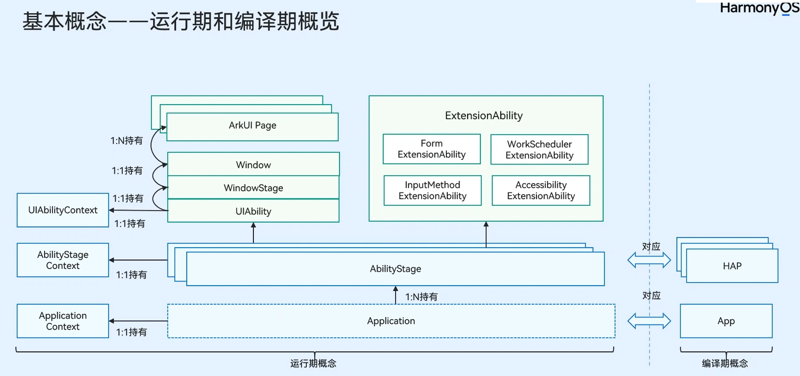
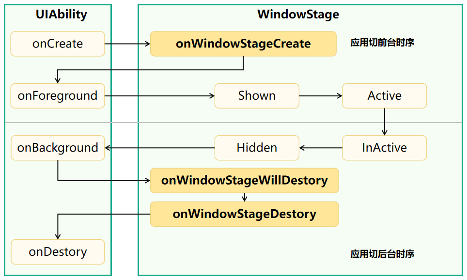
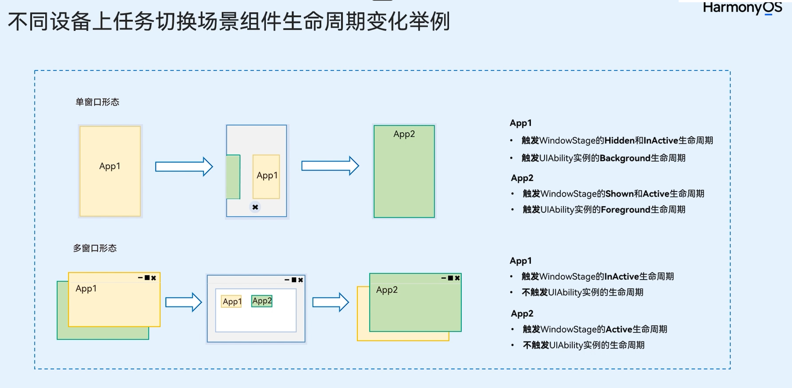

# [uiability](https://developer.huawei.com/consumer/cn/doc/harmonyos-guides-V5/uiability-overview-V5)

对于开发者而言，可以根据具体场景选择单个还是多个UIAbility，划分建议如下：

- 如果开发者希望在任务视图中看到一个任务，则建议使用一个UIAbility，多个页面的方式。

- 如果开发者希望在任务视图中看到多个任务，或者需要同时开启多个窗口，则建议使用多个UIAbility开发不同的模块功能。

### 生命周期

- onCreate abilityStage 实例创建完成之后触发
- onAcceptWant  指定实例模式的 uiability 组件启动时触发
- onConfigurationUpdated 系统发生全局配置变化时触发 （如系统的深浅色模式变化）
- onMemoryLevel 系统决定调整内存时触发(可以订阅内存的变化，释放不必要的资源，防止应用在后台时由于内存原因被释放) 

在设备上，一个uiability 对应任务视图的一个任务。

lifecycle 在单窗口和多窗口模式下触发生命周期的不同，如下图

