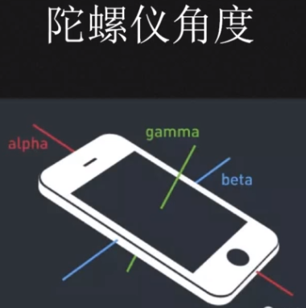
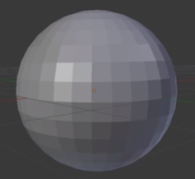

# css 3d

### 陀螺仪

陀螺仪又叫角速度传感器，是不同于加速度计 （G - sensor）的，他的测量物理量是偏转、倾斜时的转动角速度。在手机上，仅用加速度计没办法测量或重构出完整的 3D 动作，测不到转动的动作， G-sensor 只能检测轴向的线性动作。但陀螺仪可以对转动、偏转的动作作很好的测量，这样就可以精确的判断出使用者的实际动作而后根据动作可以对手机进行相应的操作。

- 陀螺仪角度

陀螺仪的角度根据手机上的三条坐标轴来确定 
alpha 纵向坐标轴(左右旋转 z轴 0 -- 360)
beta  横向坐标轴（前后旋转 x轴 -180 -- +180）
gamma 垂直坐标轴（水平旋转 y轴 -90 -- +90）

- code

1. deviceorientation设备的物理方向信息，表示一系列本地坐标系的旋角

2. devicemotion 设备的加速信息

3. compassneedscalibration 用于通知 web 站点使用罗盘信息校准上述事件

- 获取旋转角度

```js
// 获取静止时的角度
window.addEventListener("deviceorientation", function(event){
    // 处理 event.alpha\ event.bata\ event.gamma
    // absolute表示该设备是否提供绝对定位数据 (这个数据是关于地球的坐标系) 或者使用了由设备决定的专门的坐标系.
    // 如果方向数据跟地球坐标系和设备坐标系有差异，则absolute为true，如果方向数据由设备本身的坐标系提供，则absolute为false。
    var absolute = event.absolute;
    var alpha = event.alpha;
    var beta = event.beta;
    var gamma = event.gamma;
}, true)

```

- 罗盘校准

```js
window.addEventListener('compassneedscalibration', function(event){
    alert('您的罗盘需要校准')
    event.preventDefault()
}, true)

```
- 重力加速度


```js
window.addEventListener('devicemotion', function(event){
    // event.acceleration
    // x(y,z):设备在 x(y,z)方向的移动加速度值

    // evnet.accelerationIncludingGravity
    // 考虑了重力加速度后设备在 x（y，z）方向的加速度

    // event.rotationRate
    // alpha, beta, gamma : 设备绕 x,y,z 轴旋转的角度（运动时的角度）
}, true)

```

重力加速度，是一个物体受重力作用的情况下其所具有的加速度

G = mg (g = 9.80665)

- 摇一摇

```js            

window.addEventListener('devicemotion', deviceMotionHandler, true);
var x = y = z = lastX = lastY = lastZ =0;
function deviceMotionHandler(eventData) {
    var acceleration = eventData.accelerationIncludingGravity;
    var curTime = new Date().getTime();
    var diffTime = curTime - last_update;
    if (diffTime > 100) {
        last_update = curTime;
        x = acceleration.x;
        y = acceleration.y;
        z = acceleration.z;
        var x1 = Math.abs(x - last_x);
        var y1 = Math.abs(y - last_y);
        var z1 = Math.abs(z - last_z);
        var max = 0;
        if (x1 > y1) {
            if (x1 > z1) {
                max = x1;
            } else {
                max = z1;
            }
        } else {
            if (y1 > z1) {
                max = y1;
            } else {
                max = z1;
            }
        }
        if (max > 40) {
            isprint = true;
        } else if (max < 5 && isprint) {
            // var node = document.getElementById("aa");
            // var li = document.createElement("li");
            // li.innerText = num;
            // node.appendChild(li);
            // num = 0;
            isprint = false;
        }
        last_x = x;
        last_y = y;
        last_z = z;
    }
}

```

- css 3D空间

球面投影：在三维空间，每个 3D 模型都等同一个多面体（即 3D 模型只能由不弯曲的平面组成）。只能以多个正多边形表示圆，多边形的数量越多，圆就越完美



- css 3D 库

css3d-engine

- js 库

parallax

- 3D 正方形

