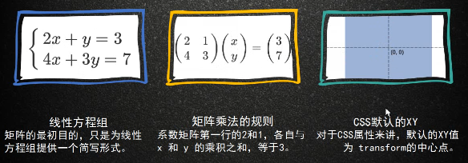

# css 与数学

- css 动画  

animation ,使用贝塞尔曲线自定义动画

- 矩阵

> 在数学中，矩阵（matrix）是一个按照长方阵列排列的复数或实数集合，最早来自于方程组的系数及常数所构成的方阵。
矩阵是高等代数学中常见的工具，也常见于统计分析等应用数学学科中。在物理学中，矩阵于电路学、力学和量子物理中都有应用。计算机科学中，三维动画的制作也需要用到矩阵。矩阵的运算是数值分析领域的重要问题。 由 m * n 个数排成的 m行 n列的数表。这 m × n 个数称为矩阵的元素，简称为元。 

矩阵的运算



```
2x + y = 3        ( 2  1 )(x)        (3)
                  (      )( )   ==   ( )
4x + 3y = 7       ( 4  3 )(y)        (7)

```

矩阵分为 2d 矩阵（3*3）和 3d矩阵（4*4）

transform: matrix(a, b, c, d, e);
无论是旋转还是拉伸，本质上都是应用的 matrix ，只是类似于 transform: rotate 这种表现形式更容易理解，所以浏览器对特定的动作进行了封装

transform-origin
通过transform origin 属性进行设置的时候，矩阵相关的计算也发生改变。实际图形效果上就是旋转拉伸的中心点变了。 

- 2d

matrix(a, b, c, d, e, f)  数值不带单位

- 如果abcd 都为0 ， 修改 e,f 则为平移  e --> x轴， f --> y轴
- 如果只修改 a和d ，其他为 0， 则为缩放  a --> 横向， d --> 纵向
- 如果只修改 b和c ，其他为 0， 则为拉伸  b --> 纵向， c --> 横向


工具

http://ds-overdesign.com/

https://github.com/Zhangdroid/CSS-Matrix3d

https://meyerweb.com/eric/tools/matrix/

http://f2e.name/f2e/case/css3/tools.html

http://play.csssecrets.io/

https://picturepan2.github.io/devices.css/