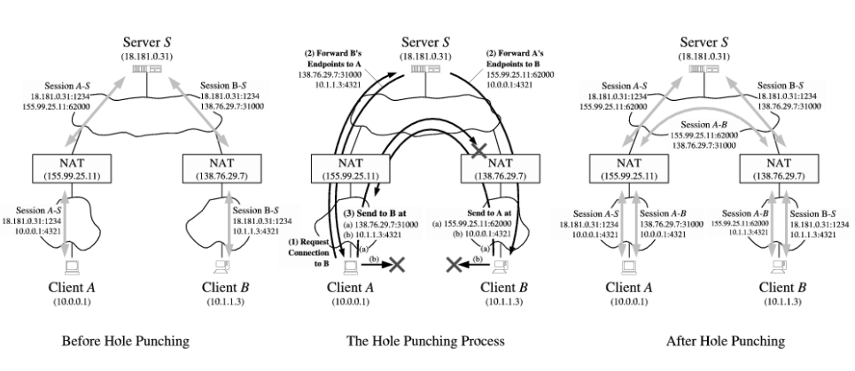

# NAT & P2P

2台设备相互链接的条件：

- 固定ip相互访问
- NAT

面对的问题
- 如何突破防火墙

## P2P 

P2P，英文全称：Peer To Peer，点对点技术，是一种区别于C/S的网络模型，没有统一的中心服务器结点，各个Client也是提供服务的Server。最早1969年4月就记录在RFC1。

- NAT

NAT（Net Address Translate，网络地址转换）是一种IP复用的一种技术，将有限的IP扩展成无限，让IPv4起死回生。这里就不说什么ABCDE类IP分类了。简单概括NAT的原理，首先是将互联网上网络进行了划分：互联网上的任意可以访问的地址组成的网络，称为公有网络，而互联网上不可访问的地址组成的网络，称为私有网络，其中，私有网络侧，一般放置客户端，而公有网络侧，一般放置服务端（先简化不考虑反向代理反向链接等概念）。

NAT作为公有网络和私有网络之间的一个桥梁，所起的作用，就是打通公有网络和私有网络的通信，具体而言，就是对于NAT设备自身，作为公有网络的一部分，其他人可以访问，而NAT设备又直接与私有网络之间形成硬件互联。一般而言，请求是由客户端发起的，而客户端是可以触达服务端的（因为服务端是在公有网络上，地址可以访问），服务端是不能直接触达客户端的，因为客户端是在私有网络。

这样，当客户端发起请求，请求经过NAT设备出去，我们知道请求是通过五元组信息进行定位，NAT设备此时就负责将请求源（也就是客户端）的IP修改为NAT设备的公有IP，目的是让服务端收到请求后，可以往一个有效地址回复数据，同时记录一下这一次请求的客户端IP到公有IP的转换到一个映射表。当服务端收到数据包，就会往NAT的公有IP回复数据包，数据到达NAT，会再次通过前面记录的映射表，查询到是哪个客户端请求的数据包，进而将数据包中转给对应的客户端。这样的话，私有网络的IP，对公网而言，就没有太大意义，可以任意定制。

通常，各个组织内部会组成这样一个私有网络，而各个组织的这些私有网络IP，都是可重复的，所以NAT本质上，就是将NAT公有IP复用给了私有网络各个客户端。

通过NAT技术的公私网络隔离，可以实现IP复用，解决了IPv4不够用的问题，但是也同时带来了新问题，直接导致TCP/IP通信困难（由于NAT导致IP成为虚拟IP，外网无法针对内网某台主机进行直连通信，因为没有真实地址可用）。由于所有服务都不得不采用C/S架构，对于提供Server的企业，带宽成本相当高，为了节省带宽成本，将NAT设备内外通信打通，利用Client端作为资源服务提供方来减少直接对Server的访问，因此产生了P2P技术。

#### P2P的优劣势

- 较佳的并行处理能力（相比于C/S架构，随着C越来越多，速度越来越慢，但是p2p网络不会有很明显的变化，所有客户端都能提供资源，包括带宽、存储空间、计算能力）
- 无中心服务器、依靠用户群（peers）交换信息，减低网路传输节点
- 不用投资大量金钱在服务器的软、硬设备

#### P2P的劣势：

- 架构较为复杂，节点之间通常存在NAT隔离，无法直接通信，导致需要额外的通路建设过程，以及各个节点的资源协调管理
- P2P节点遍布整个互联网，给开发者、组织、政府带来监控难题
- 用在大规模网路，资源分享紊乱，管理较难
- 安全性较低
- 中毒攻击：提供内容与描述不同的文件
- 拒绝服务攻击：使网络运行非常慢甚至完全崩溃
- 背叛攻击（吸血）：用户或软件使用网路却没有贡献出自己的资源
- 数据中插入病毒：下载或传递的文件可能被感染病毒木马
- P2P软件本身的木马：软件可能含有间谍软件
- 过滤：网络运营商可能会试图阻止传递来自P2P网络上的数据
- 身份攻击：跟踪网络上用户并且进行不断骚扰式或者合法性攻击
- 垃圾信息：在网路上发送未请求的信息

当然，针对P2P的安全性的一些问题，都有对应的解决方案。

### P2P分类

- 根据中央化程度

  - 一般型P2P

    - 节点同时作为客户端和服务器端
    - 没有中心服务器
    - 没有中心路由器
    - 典型代表：Gnutella，一种文件共享网络，泛滥式查询搜索所有节点

  - 特殊型P2P

    - 一个中心服务器保存节点信息
    - 节点负责发布这些信息，让中心服务器知道它们想共享什么文件
    - 路由终端使用地址，被一组索引引用来获取绝对地址
    - 典型代表：Napster，一种音乐共享网络，依赖中央服务器协调网络中的查询

  - 混合型P2P

    - 同时含有一般型和特殊型的特点
    - 典型代表：Skype

- 根据网络拓扑结构

  - 结构P2P

    - 点对点之间互有链接咨询，彼此形成特定规则拓扑结构
    - 需要请求资源时，依该拓扑结构规则寻找，若存在则一定找得到
    - 典型代表：Chord、YaCy（分布式开源免费网页搜索引擎系统，保护用户隐私，无中央服务器搜索，保证内容不被审查）、Kademlia（一种协议算法，规定网络的结构同时，规定通过节点查询进行信息交换的方式，快速定位期望的节点）

  - 无结构P2P

    - 点对点之间互有链接咨询，彼此形成无规则拓扑结构
    - 需要请求资源时，以广播方式寻找，通常会设TTL，即使存在也不一定找得到
    - 典型代表：Gnutella

  - 松散结构P2P

    - 点对点之间互有链接咨询，彼此形成无规则拓扑结构
    - 需要请求资源时，依现有咨询推测寻找，介于P2P结构和无结构型之间
    - 典型代表：Freenet（一个软件，匿名互联网领域）

## NAT技术详解

P2P中一个最为关键的技术之一，就是能穿透NAT设备。因此有必要对NAT技术有一个全貌的了解。

NAT本质为解决IPv4地址不够用而诞生的，通过IP复用达到地址几乎无限扩充。

常见的NAT有以下两种：

- 基本网络地址转换（Basic NAT）

  - 也称“静态NAT”，仅支持地址转换，不支持端口转换（一般拥有多个公网IP池可用）
  - 宽带路由器使用此方法（宽带路由器有时候被标记为DMZ主机）

- 网络地址端口转换（NAPT）
  - 允许多台主机共享一个公网IP
  - 通常由以下两种同时工作组成：
    - 源地址转换类型（内网主机发出的数据包能够到达外网主机）
    - 目标地址转换类型（外网主机发出的数据包能够到达内网主机）

### NAT的优势：

- 负载均衡：通过重定向将一些服务器的连接转向其他选定的服务器（切换IP）
- 失效终结：提供高可靠性服务，一旦路由器检测服务器宕机，自动转移到备份服务器
- 透明代理：将连接到因特网的HTTP连接重定向到HTTP代理服务器以缓存数据和过滤请求，减少带宽使用而无需配置浏览器代理

### NAT的劣势：

- 使IP会话的保持时效变短
  - 会话建立会在NAT网关上创建关联表，消耗IP端口号，而这些资源是有限的，需要能资源回收机制
  - 实时回收资源（tcp连接等，可以根据解析包，判断是会话结束时再回收资源）
  - 定时器回收（udp等无连接状态，只能根据定时，来决定数据包存活期），不同协议有效期举例：
    - DNS协议：10s
    - FTP-ctrl：300s
    - ICMP协议：10s
    - TCP协议（通常300s，fin、rst为10s，syn为10s）
    - UDP协议：240s
- 内部主机复用IP，使得依赖IP进行主机跟踪的机制都失效
  - 基于网络流量分析的应用无法跟踪到终端用户与流量的具体行为关系
  - 基于IP的用户行为日志分析变得困难，难以定位恶意攻击的主机
  - 基于IP的用户授权不再可靠
  - 服务器的连接限制，使得用户之间的服务抢占排队（本来是防止DOS攻击，防止一个用户的大量连接请求，但是这里就造成了误杀）
- 对IP端到端模型的破坏
  - NAT无法保证多个会话的关联性，当NAT网关拥有多个公有IP地址时，一组关联会话会被分配到不同的公网地址（那就需要不同的域名，很麻烦）。
  - 当公网侧需要主动向私网侧发数据，因为NAT网关未建立连接，通常数据包无法到达
- 修改IP包头信息，会妨碍一些安全协议的工作
  - 认证协议无法正常工作（NAT篡改了IP地址、传输层端口、校验和导致的，因为认证的目的是要保证这些信息在传输中不变）
  - 隧道协议存在问题（隧道协议通常用外层地址标识隧道实体，穿越NAT隧道会有IP复用关系，另一端需要小心处理，例如添加特殊标记标识自己身份）
  - ICMP协议解复用失败（因为IP对应关系被重新映射，ICMP需要复用和解复用。当ICMP的报文载荷无法提供足够的信息时，解复用会失败）
  - IP分片（通常IP分片的传输层信息（包含IP和端口号，特别是端口号）只包含在第一个分片，NAT通常依赖端口号做映射，若无传输层信息，NAT难以识别后续分片与关联表的对应关系，这就需要单独针对每个分片增加额外的端口号信息）

### NAT穿透常见解决方案

- 应用层网关（ALG）：根据传输层端口号识别协议，然后查询协议对应的IP地址和端口，转换为NAT转换表中的IP和端口，并将转换前的记录起来，形成查询关联表。这样，发送给私网侧的所有IP和端口，都是经过转换的NAT网关的IP和端口，然后私网侧发送数据包到公网侧，就会通过查询前一次记录的转换前的表，找到对应的，还原回去
  - 必须跟踪所有应用协议的升级，以及新协议
  - 有些协议加密了无法解析，也就无法转换

- 探针技术STUN：需要各个服务增加代码支持，同时部署STUN服务，利用NAT临时映射表的时效性进行打洞穿越

- 中间件技术（UPnP）：客户端参与网关公网映射信息的维护，通过UPnP向网关请求映射表，保存在客户端上，在需要发送数据的时候，直接先改写协议中涉及到的IP端口，改写为NAT网关的公网IP端口发送数据出去，NAT网关在收到外网数据时则通过UPnP建立的映射表只转换IP和端口信息（传输层）发数据到内网
  - UPnP，通用即插即用，是一个网络终端与网关的通信协议
  - 需要NAT网关、内部主机、应用程序同时支持UPnP，且组网时需要允许NAT网关和内网主机交换UPnP信令

- 中继代理技术（TURN）：一个公网的应用代理服务器做中转

- 特定协议的自穿越技术（IKE、IPSec技术）：用UDP在报文外面加一层封装，内部的报文就不再受到影响
  - 因为协议本身考虑安全新，有报文防修改的鉴别能力，其他方法都无效

### 探针打洞基本原理

#### 基本原理

基本原理：通过中间服务器的协助，在各自的NAT网关上建立映射表，使得P2P连接双方的报文能够直接穿透对方的NAT网关。客户端分别与中间服务器连接，中间服务器会记录下客户端的内网IP端口和外网IP端口。

P2P的Session建立流程：

- 客户端A和客户端B分别向集中服务器登录，集中服务器记录下他们各自的内外网IP端口（这里集中服务器需要保活和刷新各自IP端口信息）
- 客户端A最初不知道如何向客户端B发起连接，于是A向集中服务器发送消息，请求集中服务器帮助建立与客户端B的UDP连接
- 集中服务器将含有B的内外网IP端口发送给A，同时也将A的内外网IP端口发送给B
- A开始向B的内外网地址二元组发送UDP数据包，并且A会自动锁定第一个给出响应的B的地址二元组（为何需要同时发两组数据包？因为并不清楚B是与A在同一个NAT网关下，还是不同NAT网关下）
- B开始向A的内外网地址二元组发送UDP数据包，并且B会自动锁定第一个给出相应的A的地址二元组

#### 同一个NAT网关内 UDP打洞过程：

- 

##### 打洞前

- A（10.0.0.1:4321）经过NAT网关（155.99.25.11）向 S（18.181.0.31:1234）注册登录
  - 数据包经过NAT后，NAT 会给A的这次连接分配一个随机端口号62005
  - S 所看到的就是（155.99.25.11:62005向它发送信息），记录到S的映射表
- B（10.1.1.3:4321）经过NAT网关（155.99.25.11）向S（18.181.0.31:1234）注册登录
  - 数据包经过NAT后，会给B的这次连接分配一个随机端口号62000
  - S所看到的就是（155.99.25.11:62000向它发送信息），记录到S的映射表

##### 打洞中

- A（10.0.0.1:4321）经过NAT网关（155.99.25.11）向 S（18.181.0.31:1234）请求B的地址二元组信息，数据包包含A的内网地址（10.0.0.1:4321）
- A（10.0.0.1:4321）的这次请求，经过NAT网关变成了已经建立的NAT映射表上的 A’（155.99.25.11:62005）请求，向S发送
- S（18.181.0.31:1234）向它所看到的 A’（155.99.25.11:62005）发送数据包，包含了B的内外网地址信息（10.1.1.3:4321、155.99.25.11:62000），A保存了B的地址信息
- S（18.181.0.31:1234）随后又向它所看到的B’（155.99.25.11:62000）发送数据包，包含了A的内外网地址信息（10.0.0.1:4321、155.99.25.11:62005）,B保存了A的地址信息
- 随后相互通信，A向B发送数据，B向A发送数据，均是先尝试内网地址通信，若数据包相互收到，则记住对方的第一个回包地址信息，识别出对方身份，确认是内网可通信

##### 打洞后

A和B直接利用内网地址通信

注意事项：
- A和B发往对方公网地址二元组信息的UDP数据包，不一定会被对方接收到，取决于当前NAT设备是否支持不同端口之间的UDP数据包送达（Hairpin回环转换特性）
- 不过如果NAT设备支持Hairpin特性，也尽量优先以内网进行尝试

##### 不同NAT 网关间交互类似

注意：如果A发给B的包，在B发给A的包之前到达B的NAT设备，就会丢弃该包，因为默认不允许外网往内发包

#### TCP打洞

与UDP打洞的区别：

- 一般NAT设备对UDP支持更友好一些，TCP更复杂（因为NAT上的TCP协议的映射表有效期，可以- 根据TCP连接情况，主动失效，而UDP只能定时失效；NAT映射表会依据TCP发送端的端口号，也就是必须与前面注册登录时保持一致，否则发送给另一端的端口地址不一样，大概率会失败）
- UDP只需要处理一个套接字的收发通信，而TCP需要用多个套接字绑定同一个端口（端口复用）
- TCP打洞成功率远远没有UDP高（NAT防火墙策略对TCP协议不是很友好）

TCP打洞Session建立原理：

- 客户端A使用其与服务器的连接，向服务器发送请求，要求服务器协助其连接客户端B
- 服务器将客户端B的内外网的TCP地址二元组信息返回给A，同时，服务器将A的内外网TCP地址二元组发送给B
- 客户端A和B各自使用连接服务器的端口异步发起向对方的内外网地址二元组的TCP连接，同时监听各自本地TCP端口是否有外部的连接接入
- A和B开始等待向外的连接是否成功，检查是否有新连接接入。如果向外的连接，由于某种网络错误而失败，客户端可以延迟重试
- TCP连接建立起来以后，客户端之间应该开始鉴权操作，确保目前连入的连接就是所希望的连接（比对双方IP端口）。如果鉴权失败，客户端将关闭连接，等待新的连接接入。客户端只接受第一个通过鉴权的客户端，然后将进入P2P通信过程不再继续等待是否有新的连接接入

常用的打洞协议框架
- STUN（P2P解决方案，支持TCP穿透和UDP穿透）
- TURN（中继技术）
- ICE（整合了STUN、TURN）

### P2P下载技术原理

下载的本质，就是向资源服务器请求资源数据，通常是有限的Server作为资源服务器。
P2P下载，则认为所有参与下载的人，也都是资源服务器，提供内容供其他人下载。下载方，需要知道找谁下载，就是靠种子文件来提供资源服务器索引的。

P2P对比C/S下载：

- 原始的C/S模式，下载的人越多，个人分得的带宽越少
- P2P下载模式，下载的人越多，提供的带宽越大

#### 两种P2P下载技术方案

##### BitTorrent技术方案

BitTorrent协议，是2001年美国程序员发布的，是一种基于P2P文件传输通信协议，协议要求资源发布者根据文件生成提供一个.torrent文件，就是种子文件。

种子组成：

- Tracker信息：BT下载中需要用到的Tracker服务器地址和针对Tracker服务器的设置
- 文件信息：将目标文件虚拟分成大小相等的块，块大小是2K的整数次方，这里的文件信息就包含了每个块的索引信息和Hash信息

P2P种子运行基本原理：

- 下载用户，先需要取得种子信息，拿到Tracker服务器地址及相关设置
- 当用户下载了某个资源，本地资源分片落地时，就会告知Tracker服务器，Tracker服务器会记录已下载的用户信息，存储到服务器缓存（Tracker服务器所起的作用类似服务发现）
- 当有其他人需要下载时，会先连接Tracker服务器，从其中获取下载资源的Peer列表，也会包括前面已经下载过的用户
- 当Peer与Peer下载准备开始前，会通过BT软件进行打洞（比如通过NAT设备端口有效期机制等），让彼此能够进行通信，然后进行文件分片下载。BT软件有可能同时对多个分片向多个人请求资源下载，如果下载后校验Hash失败，则会尝试其他Peer

BT方案的缺陷：

- 如果Tracker服务器异常了，则可能拿不到Peer列表（单点故障）
- 如果各个Peer失效，则可能下载超时

##### Kademlia技术方案

Kademlia准确点讲，是一种P2P协议，用于DHT（Distributed Hash Table）去中心化的P2P解决方案，解决BT方案中的单点故障问题，区块链就是应用的这种解决方案。

- 每个结点都有一个ID（很长），这个ID是DHT网络中某个文件某种计算方式的HASH
- 每个结点需要负责存储文件索引、文件分片等，但是每一个结点没有一个完整的知识，只有一个片段，也不知道所有的文件片段保存在哪里
- 每个文件计算出来HASH，那么结点ID与此HASH相同或者相似，这个结点就需要知道该文件存储在哪里

Session建立原理：

- node new上线，需要下载文件1
- 首先，node new需要获取文件1的种子文件，这个种子文件中，会包含一部分结点的地址以及文件1的Hash
node new根据文件1Hash，在种子文件中这些已知的结点中问询，查找与Hash相同或相似的结点信息
- 各个结点，收到node new的请求，会首先看自身是否满足要求，如果不满足要求，就会进一步广播此请求（有种类似社交网络中找人）
- 一旦找到了结点（我们这里是node C，包含了文件1的索引），就会回复告诉node new，需要分别去B、D、F查询
- node new先与B进行Peer连接，开始下载，自己本地也有文件1了，就会告诉node C和ID相似的结点，自己也存在文件1了，可以加入那个文件的拥有者列表
- node C和其他文件1索引拥有者会将node new也加入到文件1的索引列表

P2P技术所遇到的问题

最大的问题是P2P率并不高，常常都直接向Server寻求资源，导致无法降低很多Server带宽成本。我们可以设想一下，最常见的比如我们在推送某些更新文件时，通常是统一时刻，大家更新的时间段若比较重合，就很容易引发Peer节点不足。

解决方案

通过预推文件，让下载资源提前触达到用户，主动增加Peer节点数。为此，也需要不能影响用户自身的体验，一般需要达成以下目标：

- 在用户带宽允许的前提下，提升下载速度
- 还需要严格控制用户的上行带宽，不要影响用户上网
- 保证下载质量，同时做到对大文件下载的差错控制

## 相关链接

- [how-nat-traversal-works](https://tailscale.com/blog/how-nat-traversal-works/)
- [how-nat-traversal-works_zh](http://arthurchiao.art/blog/how-nat-traversal-works-zh/)