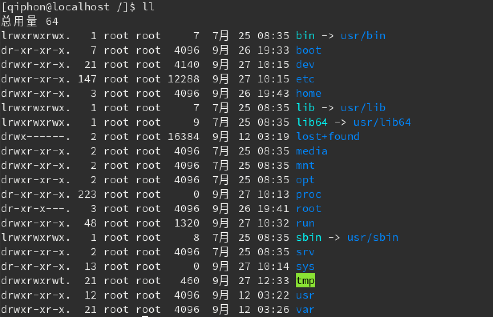
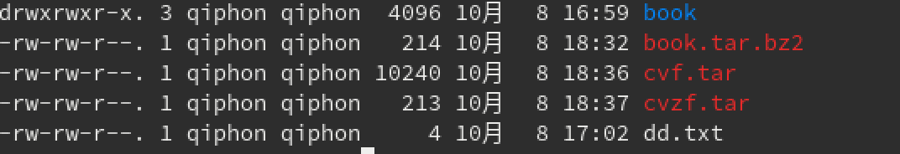
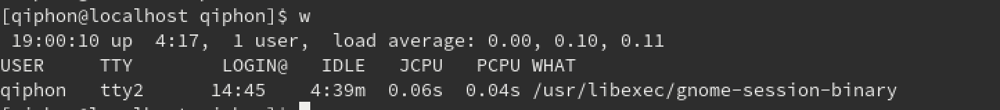
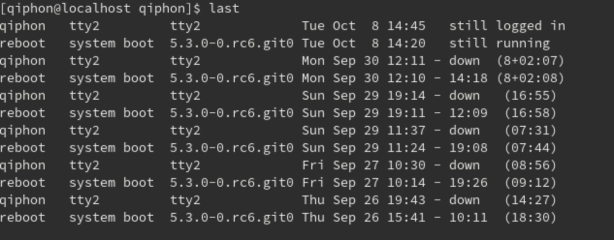
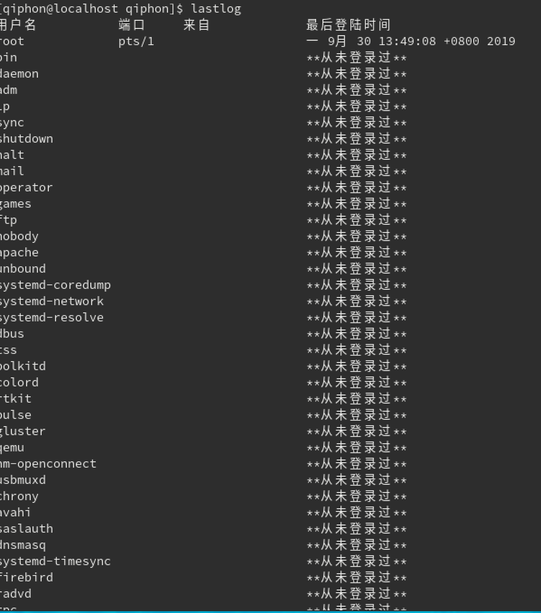

# linux 入门

1. Linux 根目录结构说明



目录结构说明

| 目录   |   解释   |
|--|--|--|--|
bin      |  存放二进制可执行文件（ls, cat, mkdir, cp, chmod, chown, date, mv, bash等），常用命令一般都在这里。bin 放置的是单人维护模式下还能够被操作的指令。 在bin底下的指令可以被root 与一般账号所使用。
usr/bin  |  众多的应用程序，``` /bin -> /usr/bin ```
sbin     |  存放二进制可执行文件，只有root 才能访问。这里存放的是系统管理员使用的系统级别的 管理命令和 程序，如 ifconfig等. Linux有非常多的指令是用来设定系统环境的，这些指令只有root 才能够利用来设定系统，其他使用者只能用来查询而已。放在 /sbin 底下的为开机过程所需要的，里面包括了开机、修复、还原系统所需要的指令。至于某些伺服器软体程式，一般则放在 /usr/sbin/ 当中。至于本机的自行安装的软件所产生的系统执行档（ system binary ），则放到 /usr/local/sbin 当中了，常见的指令包括: fdisk, fsck, ifconfig, init, mkfs 等
usr/sbin |  root用户的一些管理程序， /sbin -> /usr/sbin
boot     |  用于存放系统引导时使用的各种文件。开机会使用这个文档，包括Linux 核心档案以及开机选单与开机所需设定档等等。Linux kernel常用的文档名为：vmlinuz, 如果使用的是 grub这个开机管理程式，则还会存在 /boot/grub/ 这个目录
dev      |  用于存放设备文件 （如鼠标，键盘等），任何装置和周边设备都是以档案形式存在这个目录当中。只要通过存取这个目录下的某个档案就等于存取某个装置。 比如重要的档案有：/dev/null, /dev/zero, /dev/tty/, /dev/lp, /dev/hd, /dev/sd ,等等。
media    |  同dev相似，存放外部设备的目录（可读型的，如u盘等）。
etc      |  存放系统管理和配置文件。系统的主要设定档几乎都放置在这里， 例如人员的账号密码档、各种服务器的启始档等等。一般来说，这个目录下的各档案属性是可以让一般使用者查阅的，但是只有root可以修改。 FHS 建议不要放置可执行档（binary）在这个目录中。比较重要的档案有：/ect/inittap, /etc/init.d/ （所有服务的预设启动 script 都放置在这里，例如要启动或者关闭iptables的话，/etc/init.d/iptables start、 /etc/init.d/iptables stop）, /etc/modprobe.conf, /etc/X11/ (与X Window 有关的各种设定档都在这里，尤其是 xorg.conf 或 XF86Config 这两个 X Server的设定档), /etc/fstab, /etc/sysconfig/ 等等
home     |  存放所有用户文件的根目录，是用户主目录的基点，比如用户user的主目录就是 /home/user, 可以用 ~user 表示。这是系统预设使用者的家目录，在你新增一个一般使用者的账号时，预设的使用者家目录都会规范到这里来
root     |  超级管理员目录。之所以放置在这里，是因为进入单人维护模式而仅挂载根目录时，该目录就能够拥有 root 的家目录，所以我们希望 root 的家目录与根目录放在同一个分区中。
lib      |  存放跟文件系统中的程序运行所需要的共享库及内核模块。共享库又叫动态链接共享库，作用类似 Windows 下的 .dll 文件，存放了根文件系统程序运行所需的共享文件。系统的函数式库非常多，而 /lib 放置的则是在开机的时候会用到的库，以及在 /bin 或 /sbin 底下的指令会呼叫的函数式库而已。什么是函数式库呢？ 可以将它想成是外挂，某些指令必须要有这些外挂才能够顺利完成程式的执行之意。尤其重要的是 /lib/mmodules/ 这个目录，因为该目录会放置核心相关的模组（驱动程式）
lib64    |  大量以 .so 结尾的动态库
mnt      |  系统管理员安装临时文件系统的安装点，系统提供这个目录是让用户临时挂载其他文件系统。在很久前，这个目录的用途与 /media 相同，只是有了 /media 之后，这个目录就用来暂时暂时挂载用了
opt      |  额外安装的可选应用程序包所存放的位置。一般情况下，我们可以把 Tomcat 等都安装到这里（在以前的系统里，习惯放置在 /usr/local 目录下）。
proc     |  虚拟文件系统目录，是系统内存的映射。可以直接访问这个目录来获取系统信息
run      |  。。。
srv      |  srv 可以视为 service的缩写，是一些网络服务启动之后，这些服务所需要启用的资料目录。常见的服务例如 WWW，FTP等等。举例来说， WWW 伺服器需要网页资料就可以放置在 /srv/WWW/ 里面。
tmp      |  用于存放各种临时文件，是公用的临时文件存储点。这是让一般使用者或者是正在执行的程序暂时放置档案的地方。这个目录是任何人都能够存取的，所以不能放置重要的资料。这里要定时清理下，FHS 甚至建议在开机时清空 /tmp
var      |  用于存放运行时需要改变数据的文件，也是某些大文件的溢出区，比如各种服务的日志文件（系统启动日志）等
lost+found| 这个目录平时是空的，系统非正常关机而留下的 ”无家可归“ 的文件 。（Windows 下叫 XXX.chk）
usr      |  用于存放系统应用程序，这是最庞大的目录，要用到的应用程序和文件几乎都是在这个目录。
usr/local|  本地系统管理员软件安装目录（安装系统级的应用）。
usr/x11r6|  存放 x window 的目录
usr/doc  |  linux 文档
usr/include|  linux 下开发和编译应用程序所需要的头文件
usr/lib  |  动态链接库和软件包的配置文件
usr/man  |  帮助文档
usr/src  |  源代码，Linux内核的源代码就放在 /usr/src/linux 里
usr/local/bin | 本地增加的命令
usr/local/lib |  本地增加的库

## 区分登录用户是否是root

```
// 如果登录用户是 root
[root@localhost ~]#

```
- root  当前登录的用户  

- localhost  主机名

- ~当前工作目录，默认是用户的家目录， root就是 /root, 普通用户是 /home/用户名

- 提示符 root 是  #  ，普通用户是  $

### 命令格式

- 命令 【选项】 【参数】

- 例子  ``` ls -al ```

- 当有多个选项时，可以写在一起，如  -al 是 -a 和 -l 的缩写

## linux 基本命令

> linux 只有一个盘符（cd / ,即可以切换的系统的跟目录。 cd ~  ,会切换到用户的目录位置），

- tab 键可以补全命令和目录

#### ls & dir  目录命令

> ls 和 dir都能显示当前目录的下含有的文件或目录，但是ls命令中文件夹显示一般是蓝色的，dir则全部都是一个颜色，另外ls还拥有额外的扩展命令

```sh

ls -l  # 展示目录的详细信息

ls -a  # 查看所有的文件 （包括隐藏文件）

ls -d  # 查看目录本身的属性而非子文件

ls -k  # 人性化的方式显示文件的大小

ls -i  # 显示inode，也就是 i节点，每个文件独有的ID号

```
ls -l 显示详细信息

```  drwxr-xr-x.  21 root root  4096  9月 12 03:26 var  ```

drwxr-xr-x | .  |  21  |   root   |  root  |  9月 12 03:26  | var
--|--|--|--|--|--|--|
文件类型和权限| ACL权限 | 硬链接引用计数| 所有者 | 所属组 | 最后修改时间 | 文件名

#### 文件类型和权限

```  drwxr-xr-x  ```

- 文件类型 :  文件 - ， 目录  d ，软链接  l

- u （所有者）， g （所属组）， o （其他人）

- r （read）读取 对应值4， w （write）写 对应值 2， x （execute） 执行 对应值 1

```

// 输入 ls -l 命令就会看到这的一个列表

drwx------  6 qifeng  staff   192B  4 22 13:50 Documents
drwx------ 14 qifeng  staff   448B  8  7 15:19 Downloads
drwx------ 75 qifeng  staff   2.3K  8  2 10:34 Library
drwx------  4 qifeng  staff   128B  8  7 15:32 Movies
drwx------  4 qifeng  staff   128B  4 30 10:25 Music
drwx------  3 qifeng  staff    96B  4 19 10:54 Pictures


第一位 的d 代表是目录
        l 表示链接
        - 表示是文件

后面的9位是 文件的权限，rwx （r 可读 用4表示，w 可写 用2表示， x 可执行 用1表示） ，分为3组（分别是用户，用户组，其他人 的权限）


```

### 文件处理命令

#### mkdir  创建文件夹

```
-p  // 如果文件不存在则创建，不会报错

-m  // 添加目录权限

-v  // 显示命令状态  成功失败等

```

#### touch  新建文件

####  rmdir 删除文件夹（只能删除空的文件夹）

#### mv 移动文件

#### rm 删除文件/文件夹  

>（rm -rf *   删除该目录下所有文件）

```
-r  删除目录

-f  强制删除

```

####  ln 创建链接

> ln -s 目标文件 要创建的软连接地址     --》 在指定位置创建一个软链接

软链接 | 硬链接
--|--|
lrwxrwxrwx. | -rw-rw-r--.
权限都是 777 | 权限和源文件一样
和源文件有不同iNode和block块（但是数据块中只保存源文件名和源文件节点号）  |  和源文件有相同 iNode和存储block块
可以对目录使用 | 不能对目录使用
删除源文件链接不能使用  | 删除源文件可以继续使用

> 没有 -s 的时候，创建的链接是硬链接。硬链接可以通过iNode 访问，不能跨分区，不能针对目录使用，使用的情况很少

#### cat 打开指定的文件

#### pwd 查看当前的目录

#### cp  复制命令

cp 【原文件或目录】 【目标文件或目录】

> 复制到目标位置的时候可以用另一个名字

```
-r   // 复制目录，默认是复制文件

-p   // 连带文件属性复制

-d   // 若源文件是链接文件，则复制链接属性

-a   // 相当于 -rpd

```

### 搜索命令

#### locate

- 在后台数据库中按文件名搜索， 速度比较快

- 数据存储在 /var/lib/mlocate 后台数据库，每天更新一次

- 可以使用 updatedb 命令立刻更新数据库

- 只能搜索文件名

```
-e  将排除在寻找的范围之外。
-1  如果是1．则启动安全模式。在安全模式下，使用者只能看到权限范围内的档案。这会使速度减慢，因为locate必须从实际的档案系统中取得档案的权限资料。
-f  将特定的档案系统排除在外，例如我们没有道理要把proc档案系统中的档案放在资料库中。
-q  安静模式，不会显示任何错误讯息。
-n  最多显示n个输出。
-r  使用正规运算式做寻找的条件。
-o  指定资料库的名称。
-d  指定资料库的路径
-h  显示辅助讯息
-V  显示程式的版本讯息

```

```  /etc/updatedb.conf  ```

建立索引的配置文件

- PRUNE_BIND_MOUNTS = "yes" 全部生效，开启搜索限制

- PRUNEFS  不搜索的文件系统

- PRUNENAMES  忽略的文件类型

- PRUNEPATHS  忽略的路径

#### find 文件搜索（性能低）

find 【搜索范围】 【搜索条件】

##### 按名称搜索

- 避免大范围搜索，会非常耗系统资源

> find ~/qiphon -name aaa.log

##### 通配符

- find 是在系统当中搜索符合条件的文件名，如果需要匹配，使用通配符匹配，通配符是完全匹配

- 通配符

1.  ``` * ``` 匹配任意内容
2. ``` ?  ``` 匹配任意一个字符
3. ``` [] ``` 匹配任意括号内的字符

```sh

find . -name 'c[abc]'
find . -name 'c[abc]*'

```
##### -i 不区分大小写

```sh

find . -iname 'c[abc]'
find . -iname 'c[abc]*'

```

##### -user  按所有者搜索

```sh

find . -user qiphon

```

##### 按时间搜索

```sh

find /nginx/access.log -mtime +5

// atime   访问时间
// ctime   改变文件属性
// mtime   修改文件内容

// -5      5天内修改的文件
// 5       5天前这个时间修改的文件
// +5      5天前修改的文件

```

##### 按大小搜索

- k 小写， M 大写

参数 |  含义
--|--|
-8k |  小于8k
8k  |  等于 8k
+8k |  大于8M
-8M |  小于8M

> find . -size +8M

##### -inum  按iNode 查找

> find . -inum 123

##### 综合应用

1. 查找大于 10k 小于 20k 的文件

> find /tmp -size +10k -a -size -20k

```
-a  and 逻辑与，2个条件都满足

-o  or  逻辑或，2个条件满足一个就可以

```

> 有时一个文件名很复杂，不能正确敲出来（以至于不能删除），可以使用find和i节点共同完成

> ``` find . -inum 31531 -exec rm {} \; ```

#### whereis 搜索命令所在路径以及帮助文档的位置

whereis 命令名

> whereis ls

```
-b   // 只查找可执行文件

-m   // 只查找帮助文件

```

#### which 命令搜索

- 可以看到别名

- 能看到的都是外部安装的命令

- 无法查看shell 自带的命令

##### grep 在文件中匹配符合条件的字符串

> grep '10' ss

```
-i  // 忽略大小写

-v  // 排除指定字符串

find . -inum 312323 -exec grep -i 's' {} \;

```

- find命令，在系统中搜索符合条件的文件名，如果需要匹配使用通配符匹配，通配符是完全匹配
- grep 命令：在文件中搜索符合条件的字符串，如果需要匹配，使用正则表达式进行匹配，正则表达式是包含匹配

### 帮助命令

#### man 查看指定命令的帮助文档

##### 基本用法

> man ls

##### 关键字搜索

> man -K mkdir

##### shell 内部帮助

> whereis 

找到就是外部，找不到就是内部

> help cd

### 压缩与解压命令

> .zip  .gz  .bz2  .tar.gz  .tar.bz2

#### zip 格式

- 压缩文件 zip 压缩文件名 源文件

- 压缩目录 zip -r 压缩文件名 源目录

- 解压 unzip 压缩文件名

```sh

mkdir book 

touch book/1.md

zip ../新文件名 book

unzip ../新文件名.zip

```

#### gzip

命令 | 示例 | 含义
--|--|--|
gzip 源文件    |  gzip a.text                      |  压缩为 .gz 格式的压缩文件，源文件会消失
gzip -k 源文件    |  gzip -k a.text                |  压缩为 .gz 格式的压缩文件，保留源文件
gzip -c 源文件 > 压缩文件 | gzip -c a.txt > b.txt.gz  |  压缩为 .gz 格式，源文件不消失
gzip -r 目录  |  gzip -r ddd                       |  压缩目录下的所有文件，不保留源文件
gzip -d 压缩文件名  |  gzip -d ddd.gz                | 解压
gunzip 压缩文件名  |  gunzip ddd.gz                 | 解压
gunzip -r 压缩文件名  |  gunzip -r ddd               | 解压该目录下的所有 .gz 文件

> 压缩目录是压缩目录下的文件

#### .bz2 格式压缩

命令 | 示例 | 含义
--|--|--|
bzip2 源文件        |  bzip2 aa.txt    | 压缩文件，不保留源文件
bzip2 -k 源文件     |  bzip2 -k aa.txt | 压缩文件，保留源文件
bzip2 -d 压缩文件名  |  bzip2 -d dd.txt.bz2 | 解压
bunzip2 压缩文件名  |  bunzip2 dd.txt.bz2 | 解压

> bzip2 不能压缩目录

#### tar 打包命令

```
-c  打包
-v  显示过程
-f  指定打包后的文件名
-x  解包
-z  打包同时压缩/解压缩 （如果有-c就是压缩，如果有-x就是解压缩）gzip格式
-j  打包同时压缩/解压缩 （如果有-c就是压缩，如果有-x就是解压缩）bzip2格式

```

命令 | 示例 | 含义
--|--|--|
tar -cvf 打包文件名 源文件   |   tar -cvf  aa.tar aa.txt   |  打包文件
tar -xvf 压缩的包名   |   tar -cvf  aa.tar                |  解包文件

- 压缩后文件大小比较



> 不管用什么格式压缩的打包文件，都可以直接使用 tar -xf  这种方式解压
 
### 关机和重启命令

#### shutdown 

```
-c  // 取消前一个关机命令

-h  // 关机

-r  // 重启

shutdown -h now // 立刻关机

shutdown -r 07:00  // 7点关机

shutdown -r now // (或者是 reboot) 立刻重启计算机

shutdown -c  // 取消关机命令

```

#### init 命令

> 0: 关机
1:单用户
2: 不完全多用户，没有NFS （网络文件系统） 服务
3: 多用户有网络服务
4: 系统未使用保留给用户
5: 图形界面
6: 系统重启

执行方式：  init 6    ——》这样就是重启系统


#### logout  注销用户

### 查看用户信息

#### w 命令

- USER  登录的用户名

- TTY  登录的终端 tty 本地终端， pts/0 远程终端

- FROM 登录的IP

- LOGIN 登录时间

- IDEL  用户闲置时间

- JCPU  该终端所有进程占用的时间

- PCPU  当前进程所占用的时间

- WHAT  正在执行的命令 



#### who 

- USER  登录的用户名

- TTY  登录的终端 tty 本地终端， pts/0 远程终端

- LOGIN 登录时间


#### whoami    查看当前用户

#### last 查看当前登录和过去登录的用户信息 （默认读取 /var/log/wtmp 文件）

依次是  用户名 - 登录终端 - 【登录IP】 - 登录时间 - 退出时间



#### lastlog  查看所有用户最后的登录时间

依次是  - 用户名 - 登录终端 - 登录IP - 最后一次登录时间



## shell

- shell 是一个命令行解释器，它为用户提供了一个向Linux 内核发送请求以便以便运行程序的界面系统级程序
- 用户可以用shell来启动、挂起、停止或者编写一些程序
- shell 还是一个功能相当强大的编程语言，易编写、易调试、灵活性较强
- shell 是解释执行的脚本语言，在shell中可以直接调用 Linux 系统命令

### 查看支持的 shell

```sh
/etc/shells

```
### echo

- 输出命令

- ``` -e ``` 支持反斜线控制的字符转换

控制字符  |  作用
--|--|--|
\a     |    输出警告音
\b     |    退格键，也就是向左删除键
\n     |    还行符
\r     |    回车键
\t     |    制表符
\v     |    垂直制表符
\onnn  |    按照八进制 ASCII 码表输出字符，其中0 为数字零， nnn是三位八进制数
\xhh   |    按照十六进制 ASCII 码表输出字符，其中 hh 是2位十六进制数

### 编写执行 shell、

写一个 hello.sh文件

```sh

#!/bin/bash
echo -e "\e[1;34m hello world \e[0m"

```

赋予执行权限，直接运行即可

```sh

sudo chmod 755 hello.sh

./hello.sh

# 或者直接用 bash 运行

bash hello.sh

```

### 别名

- 命令别名 == 小名

- 临时生效

- alias

- ```alias rm="rm -i"```

- 写入环境变量配置文件 ``` vi ~/.bashrc ```

- ``` source ~/.bashrc ```

- unalias 别名  -> 删除别名

### 命令的生效顺序

1. 绝对路径或相对路径

2. 别名

3. bash 内部命令

4. 按照 $PASH 环境变量定义的目录查找顺序找到的第一个命令

### 命令快捷键

命令     |  含义
--|--|
ctrl + c  |  强制终止当前命令
ctrl + l  |  清屏
ctrl + a  |  光标移动到命令行首
ctrl + e  |  光标移动到命令行尾部
ctrl + u  |  从光标所在位置删除到行首
ctrl + z  |  把命令放入后台
ctrl + r  |  在历史命令中搜索


### 历史命令 

- history [options] [历史命令保存文件]

- options

- -  -c 清空历史命令

- -  -w 把缓存中的历史命令写入到历史命令保存文件 ～/.bash_history

- 默认保存 1000 条 /etc/profile HISSIZE=1000

### 调用

- 使用上下箭头调用历史命令

- 使用 !n 重复执行第 n 条历史命令

- 使用 !! 重复执行上一条命令

- 使用 !字符 重复执行最后一条以该字符串开头的命令

### 管道符

#### 多个命令顺序执行

1. ; 分号，没有任何逻辑关系的连接符。当有多个命令用分号连接时，各命令之间的执行成功与否彼此没有任何影响，都会一条条执行下去

2. || 逻辑或, 当用此连接符连接多个命令时，前面的命令执行成功，则后面的命令不会执行；前面的命令执行失败，后面的命令会执行

3. && 逻辑与，前面命令执行成功才会执行后面的命令，否则后面的命令不会执行

4. | 管道符，前面的命令执行的正确输出，会交给后面的命令继续处理；若前面的命令执行失败，则报错，若后面的命令无法处理前面命令的输出，也会报错

```sh
date ;ls ; date; ls;

ls && echo yes || echo no

```

#### 管道符使用

1. 命令1的正确输出会作为命令2的操作对象

2. 命令1 | 命令2

```sh

ls /etc/ | more

netstat -an | grep ESTABLISHED | wc -l

```

#### 通配符

匹配文文件名和目目录名 
|通配符|作用用| 
|----|----| 
|?|匹配一一个任意字符| 
|*|匹配0个或任意字符,也就是可以匹配任意内容| 
|[]|匹配中括号中任意一一个字符| 
|[-]|匹配中括号中任意一一个字符,-代表范围| 
|[^]|匹配不不是中括号中的一一个字符|

#### 其他符号

符号    |  作用
--|--|
''      |  单引号，在单引号中所有的特殊字符都没有特殊的含义，如 $, `
""      |  双引号，在双引号里特殊符号都没有特殊的含义，但是 $ , ` , \ 例外，拥有变量值，引用命令和转义的含义
``      |  反引号，括起来的是系统命令
$()     |  和反引号一样
```# ```|  在shell脚本中，#表示注释
$       |  用于调用变量的值
\       |  转义符号


## 用户和用户组

- 使用操作系统的人都是用户

- 用户组是拥有相同系统权限的一群人

### 用户组

#### ``` /etc/group ```

- /etc/group 存储当前系统中所有用户组信息

- group:x:123:abc,def

- 组名称:组密码占位符：组编号：组中用户名列表

- root 组编号为 0

- 1-499 系统预留的编号，预留给安装的软件和服务的

- 用户手动创建的组从500 开始

- 组密码的占位符都是 x

#### ```  /etc/gshadow  ```

- 存放当前系统中用户组的密码信息

- 和group 中的记录 一一对应

- ``` Group:*::abc ```

- 组名 组密码 组管理者 组中用户名

#### ``` /etc/passwd ```

- 存储当前系统中所有用户的信息

- ``` root:x:0:0:root:/root:/bin/bash ```

- 用户名 ：密码占位符：用户编号：用户注释信息：用户目录：shell 类型


#### ``` /etc/shadow ```

- 存放当前系统中所有用户的密码信息

- ```  root:x:0:  ```

- 用户名：密码占位符：用户编号

### 用户操作

```sh

# 添加组

groupadd qiphon

# 修改组名

groupmod -n qifeng qiphon

# 修改组编号

groupmod -g 555 qiphon

# 添加分组并指定编号

groupadd -g 333 teacher

# 删除分组

groupdel 333

# 添加用户并指定分组

useradd -g teacher zhangsan

# 修改用户分组

usermod -g stu zhangsan

# 为用户指定工作目录

useradd -d /home/zhangsan zhangsan

# 修改用户名

usermod -l zhangsan zhangsan2

# 指定注释

uermod -c iamateacher zhangsan

# 删除用户

userdel zhangsan2

# 删除所属文件夹

userdel -r lisi


```

### 用户命令
