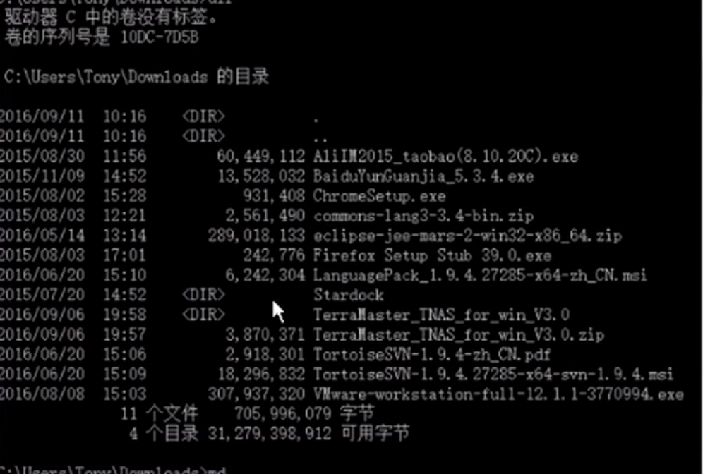

# windows 命令

1. dir 查看文件和目录

> 目录文件前面有 ``` <DIR> ``` 标识，普通的文件前面有一排数字，指示文件的大小



2. 切换目录 

> cd dirName    (. 表示当前目录， .. 表示上一级目录)

3. 创建文件夹   

> md dirName

4. 复制文件   

> copy  【要复制的文件】   【想要复制到的路径】

5. 删除文件  

> del  要删的文件名   （这个命令系统不会给出提示，并且文件不会在回收站内）

6. 改文件名  

> rename 要改名的文件  新的文件名

## windows 下的Linux 环境软件 [cygwin](http://www.cygwin.com)

- select packages  --> full