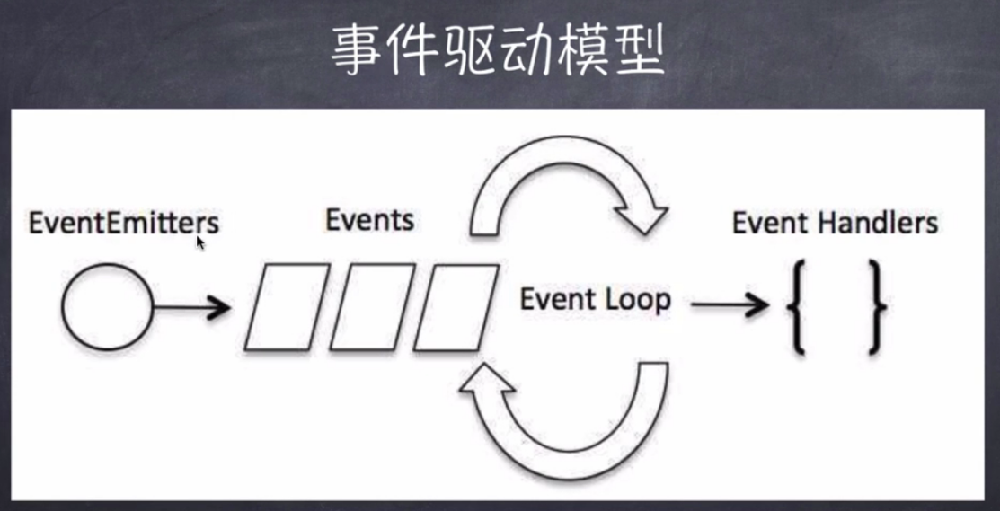

# nodejs

- 什么是nodejs

    - nodejs本质是一个 js 解析器
    - nodejs 是 js 的运行环境
    - nodejs 是 服务器程序
    - nodejs 本身使用的是 V8 引擎
    - node 不是 web 服务器

- 为什么使用nodejs
    - 为了提供高性能web服务
    - io性能强大
    - 事件处理机制完善
    - 天然能够处理dom
    - 社区活跃，生态圈日趋完善

- 优势
    - 处理大流量数据
    - 适合实时交互应用
    - 完美支持对象数据库
    - 异步处理大量并发连接

- 学习node需要的前置知识
    - js es6+
    - 服务器相关知识
    - 最好在Linux下开发

- 相关资源
    - nodejs.org
    - nodejs.cn
    - github.com

- 安装

官网下载对应版本

`node -v` 查看版本号

    - npm nodejs包管理工具  npmjs.com
        - 允许用户下载第三方包
        - 下载别人编写的命令行程序
        - 可以上传自己的代码包
        - 淘宝 cnpm   `npm i cnpm -g` 如果包下载不下来，可以使用cnpm
        - npm -v  查看版本
        - 直接输入 npm 会显示所有的npm 命令
        - npm 装包

            ```sh
            # -g 全局安装
            npm i express -g 
            # 卸载
            npm uninstall express -g
            # 查找包
            npm search express
            # 查看指定命令的详细信息
            npm help install

            ```
### 开发阶段，监控文件修改，自动重启node

```
npm install -g nodemon    //全局安装
npm install nodemon --save   //局部安装

nodemon app.js

```


- 写一个helloworld

```js
// hello.js
console.log('hello world')

// 执行
node ./hello.js

```

- 写一个nodejs 服务

```js
// server.js
var http = require('http')

http.createServer(function(req, res){
    // 定义返回头
    res.writeHead(200, {
        "Content-Type": 'text/plain'
    })
    // 发送相应数据
    res.end('hello world\n')
})
.listen(3000)

// 服务运行成功提示
console.log('server is running...')

// 运行服务
node server.js

```

- repl 环境

在终端中输入 node 就进入到了nodejs 的 repl 环境。这里可以执行一些简单的任务

```sh
node

var x = 10 
var y = 5
x+ y

# 退出命令 ctrl + c
# 上下箭头 切换之前输入的命令
# .exit 退出
# .help 查看帮助
# .break 退出多行表达式
# .clear 退出多行表达式
# .save filename  保存当前的 node repl 回话到文件
# .load filename  载入文件到当前会话

```

-  什么是回调

    - 函数的调用方式： 同步调用，回调，异步调用
    - 回调是一种双向调用模式
    - 可以通过回调函数来实现回调
- 阻塞 与 非阻塞
    - 阻塞与非阻塞关注的是程序在等待调用结果（消息，返回值）时的状态
    - 阻塞就是做不完不会做其他事
    - 非阻塞就是一个任务正在做，当另一个任务到的时候，不会等待上一个任务做完在做下一个

    ```js
    // 阻塞式代码
    var fs = require('fs')

    var data = fs.readFileSync('server.js')

    console.log(data.toString())
    console.log('file read finish')

    // 非阻塞代码
    fs.readFile('server.js', (err, data)=>{
        if(!err){
            console.log(data.toString())
        }
    })
    console.log('我会在文件读取前打印')

    ```

- nodejs 事件驱动机制

    - 事件驱动模型 
        - eventEmitters -> event -> event loop -> event Handlers

        ```js
        // 事件处理代码

        // 引入event 模块创建事件对象
        var events = require('events')
        var eventEmitter = new events.EventEmitter()
        // 绑定事件函数
        var connectHandler = function () {
            console.log('connect事件被调用')
        }
        eventEmitter.on('connect', connectHandler)
        // 触发事件
        eventEmitter.emit('connect')

        console.log('程序执行完毕')

        ```
- nodejs 模块化
    - 模块化的概念和意义
        - 为了让 nodejs 的文件可以相互调用，nodejs 提供了一个简单的模块系统
        - 模块是 nodejs 应用程序的基本组成部分
        - 文件和模块是一一对应的。 一个文件就是一个模块（文件可以是js代码、json、编译过的c/c++ 扩展）
        - nodejs中存在4类模块（原生模块和3种文件模块）

        ```
        // 模块加载流程
        
                        require 请求文件
                                |
                        是否在文件模块缓存区---------|
                                |                 |
                                否                |
                                |                 |
                    --------是否是原生模块          |
                    |           |                 |
                    是          否                是
                    |           |                 |
                    |       查找文件模块            |
                是否在原生模块    |                 |
        ----------缓存区         |                 |
        |           |       根据扩展名载入模块       |
        |           否          |                 |
        |           |        缓存文件模块           |
        |        加载原生模块    |                  |
        |           |          |                  |
        是       缓存原生模块    |                  |
        |           |          |                  |
        |           |----------|                  |        
        |                      |                  |
        |---------------- 返回 exports  -----------           

        ```
    - nodejs 模块加载方式
        - 从文件模块缓存中加载
        - 从原生模块加载
        - 从文件加载
    
    - require 加载方式
        - 原生模块 直接写文件名 http、fs、path
        - 相对路径 引入模块 `require('../js/a.js')`
        - 绝对路径引入（不推荐）
        
        ```js
        // a.js
        function hello (){
            var name;
            this.setName = argname => name = argname;
            this.say = () => console.log(`hello ${name}`)
        }

        module.exports = hello;

        // b.js
        var hello = require('./a.js')

        var hello = new hello()
        hello.setName('yideng')

        hello.say()

        ```
- nodejs 路由
    - 我们要为路由提供请求的 URL 和其他需要的 GET 及 POST 参数，随后路由需要根据这些数据来执行相应的代码。

    - 因此，我们需要查看 HTTP 请求，从中提取出请求的 URL 以及 GET/POST 参数。这一功能应当属于路由还是服务器（甚至作为一个模块自身的功能）确实值得探讨，但这里暂定其为我们的HTTP服务器的功能。

    - 我们需要的所有数据都会包含在 request 对象中，该对象作为 onRequest() 回调函数的第一个参数传递。但是为了解析这些数据，我们需要额外的 Node.JS 模块，它们分别是 url 和 querystring 模块。

    ```
                    url.parse(string).query
                                            |
            url.parse(string).pathname      |
                        |                   |
                        |                   |
                        ------ -------------------
    http://localhost:8888/start?foo=bar&hello=world
                                    ---       -----
                                    |           |
                                    |           |
        querystring.parse(queryString)["foo"]   |
                                                |
                            querystring.parse(queryString)["hello"]

    ```
    现在我们来给 onRequest() 函数加上一些逻辑，用来找出浏览器请求的 URL 路径：

    ```js

    var http = require("http");
    var url = require("url");
    
    function start() {
    function onRequest(request, response) {
        var pathname = url.parse(request.url).pathname;
        console.log("Request for " + pathname + " received.");
        response.writeHead(200, {"Content-Type": "text/plain"});
        response.write("Hello World");
        response.end();
    }
    
    http.createServer(onRequest).listen(8888);
    console.log("Server has started.");
    }
    
    exports.start = start;
    ```

    - get/post
        - 由于GET请求直接被嵌入在路径中，URL是完整的请求路径，包括了?后面的部分，因此你可以手动解析后面的内容作为GET请求的参数。

        - node.js 中 url 模块中的 parse 函数提供了这个功能。

    ```js
    // get
    var http = require('http');
    var url = require('url');
    var util = require('util');
    
    http.createServer(function(req, res){
        res.writeHead(200, {'Content-Type': 'text/plain; charset=utf-8'});
        res.end(util.inspect(url.parse(req.url, true)));
    }).listen(3000);

    // 获取 URL中的参数
    var http = require('http');
    var url = require('url');
    var util = require('util');
    
    http.createServer(function(req, res){
        res.writeHead(200, {'Content-Type': 'text/plain'});
    
        // 解析 url 参数
        var params = url.parse(req.url, true).query;
        res.write("网站名：" + params.name);
        res.write("\n");
        res.write("网站 URL：" + params.url);
        res.end();
    
    }).listen(3000);


    // POST 请求的内容全部的都在请求体中，http.ServerRequest 并没有一个属性内容为请求体，原因是等待请求体传输可能是一件耗时的工作。

    // 比如上传文件，而很多时候我们可能并不需要理会请求体的内容，恶意的POST请求会大大消耗服务器的资源，所以 node.js 默认是不会解析请求体的，当你需要的时候，需要手动来做。
    var http = require('http');
    var querystring = require('querystring');
    
    var postHTML = 
    '<html><head><meta charset="utf-8"><title>菜鸟教程 Node.js 实例</title></head>' +
    '<body>' +
    '<form method="post">' +
    '网站名： <input name="name"><br>' +
    '网站 URL： <input name="url"><br>' +
    '<input type="submit">' +
    '</form>' +
    '</body></html>';
 
    http.createServer(function (req, res) {
    var body = "";
    req.on('data', function (chunk) {
        body += chunk;
    });
    req.on('end', function () {
        // 解析参数
        body = querystring.parse(body);
        // 设置响应头部信息及编码
        res.writeHead(200, {'Content-Type': 'text/html; charset=utf8'});
    
        if(body.name && body.url) { // 输出提交的数据
            res.write("网站名：" + body.name);
            res.write("<br>");
            res.write("网站 URL：" + body.url);
        } else {  // 输出表单
            res.write(postHTML);
        }
        res.end();
    });
    }).listen(3000);

    ```

- 全局对象

> JavaScript 中有一个特殊的对象，称为全局对象（Global Object），它及其所有属性都可以在程序的任何地方访问，即全局变量。

在浏览器 JavaScript 中，通常 window 是全局对象， 而 Node.js 中的全局对象是 global，所有全局变量（除了 global 本身以外）都是 global 对象的属性。

在 Node.js 我们可以直接访问到 global 的属性，而不需要在应用中包含它。


> 全局对象与全局变量
    global 最根本的作用是作为全局变量的宿主。按照 ECMAScript 的定义，满足以下条 件的变量是全局变量：

    - 在最外层定义的变量；
    - 全局对象的属性；
    - 隐式定义的变量（未定义直接赋值的变量）。

当你定义一个全局变量时，这个变量同时也会成为全局对象的属性，反之亦然。需要注 意的是，在 Node.js 中你不可能在最外层定义变量，因为所有用户代码都是属于当前模块的， 而模块本身不是最外层上下文。

注意： 最好不要使用 var 定义变量以避免引入全局变量，因为全局变量会污染命名空间，提高代码的耦合风险。

    - `__filename` 表示当前正在执行的脚本的文件名。它将输出文件所在位置的绝对路径，且和命令行参数所指定的文件名不一定相同。 如果在模块中，返回的值是模块文件的路径。

    - `__dirname`  表示当前执行脚本所在的目录。

    - `setTimeout(cb, ms)` 和 js 的一样
    - `clearTimeout`
    - `setInterval(cb, ms)`
    - `setInterval`
    - console. log/info/error/warn/dir/time/timeEnd/trace/assert

    - process process 是一个全局变量，即 global 对象的属性。
    它用于描述当前Node.js 进程状态的对象，提供了一个与操作系统的简单接口。通常在你写本地命令行程序的时候，少不了要 和它打交道。下面将会介绍 process 对象的一些最常用的成员方法。 

        - exit 当进程准备退出时触发。
        - beforeExit 当 node 清空事件循环，并且没有其他安排时触发这个事件。通常来说，当没有进程安排时 node 退出，但是 'beforeExit' 的监听器可以异步调用，这样 node 就会继续执行。
        - uncaughtException 当一个异常冒泡回到事件循环，触发这个事件。如果给异常添加了监视器，默认的操作（打印堆栈跟踪信息并退出）就不会发生。
        - Signal 当进程接收到信号时就触发。信号列表详见标准的 POSIX 信号名，如 SIGINT、SIGUSR1 等。

- nodejs 常用工具

    - util 是一个Node.js 核心模块，提供常用函数的集合，用于弥补核心 JavaScript 的功能 过于精简的不足。
    - 当 util 的功能仍不满足需要时，可以使用 [underscorejs](https://underscorejs.bootcss.com/)

    - util.callbackify 将 async 异步函数（或者一个返回值为 Promise 的函数）转换成遵循异常优先的回调风格的函数
        
        ```js

        const util = require('util');

        async function fn() {
        return 'hello world';
        }
        const callbackFunction = util.callbackify(fn);

        callbackFunction((err, ret) => {
        if (err) throw err;
        console.log(ret);
        });

        // 异常的
        function fn() {
        return Promise.reject(null);
        }
        const callbackFunction = util.callbackify(fn);

        callbackFunction((err, ret) => {
        // 当 Promise 被以 `null` 拒绝时，它被包装为 Error 并且原始值存储在 `reason` 中。
        err && err.hasOwnProperty('reason') && err.reason === null;  // true
        });

        ```
    - util.inherits(constructor, superConstructor) 是一个实现对象间原型继承的函数

        ```js
        var util = require('util'); 
        function Base() { 
            this.name = 'base'; 
            this.base = 1991; 
            this.sayHello = function() { 
            console.log('Hello ' + this.name); 
            }; 
        } 
        Base.prototype.showName = function() { 
            console.log(this.name);
        }; 
        function Sub() { 
            this.name = 'sub'; 
        } 
        util.inherits(Sub, Base); 
        var objBase = new Base(); 
        objBase.showName(); 
        objBase.sayHello(); 
        console.log(objBase); 
        var objSub = new Sub(); 
        objSub.showName(); 
        //objSub.sayHello(); 
        console.log(objSub); 

        // base 
        // Hello base 
        // { name: 'base', base: 1991, sayHello: // [Function] } 
        // sub 
        // { name: 'sub' }

        // 注意：Sub 仅仅继承了Base 在原型中定义的函数，而构造函数内部创造的 base 属 性和 sayHello 函数都没有被 Sub 继承。

        // 同时，在原型中定义的属性不会被 console.log 作 为对象的属性输出。如果我们去掉 objSub.sayHello(); 这行的注释，将会看到：
        node.js:201 
        throw e; // process.nextTick error, or 'error' event on first tick 
        ^ 
        TypeError: Object #&lt;Sub&gt; has no method 'sayHello' 
        at Object.&lt;anonymous&gt; (/home/byvoid/utilinherits.js:29:8) 
        at Module._compile (module.js:441:26) 
        at Object..js (module.js:459:10) 
        at Module.load (module.js:348:31) 
        at Function._load (module.js:308:12) 
        at Array.0 (module.js:479:10) 
        at EventEmitter._tickCallback (node.js:192:40) 

        ```

    - `util.inspect(object, [showHidden], [depth], [colors])` 是一个将任意对象转换 为字符串的方法，通常用于调试和错误输出
        - object 要输出的对象
        - showHidden 是一个可选参数，如果值为 true，将会输出更多隐藏信息。
        - depth 表示最大递归的层数，如果对象很复杂，你可以指定层数以控制输出信息的多 少。如果不指定depth，默认会递归 2 层，指定为 null 表示将不限递归层数完整遍历对象
        -  如果 colors 值为 true，输出格式将会以 ANSI 颜色编码，通常用于在终端显示更漂亮 的效果。

        ```js
        var util = require('util'); 
        function Person() { 
            this.name = 'byvoid'; 
            this.toString = function() { 
            return this.name; 
            }; 
        } 
        var obj = new Person(); 
        console.log(util.inspect(obj)); 
        console.log(util.inspect(obj, true)); 

        // result
        Person { name: 'byvoid', toString: [Function] }
        Person {
        name: 'byvoid',
        toString: 
        { [Function]
            [length]: 0,
            [name]: '',
            [arguments]: null,
            [caller]: null,
            [prototype]: { [constructor]: [Circular] } } }

        ```
    - `util.isArray(obj)` 如果给定的参数 "object" 是一个数组返回 true，否则返回 false。

        ```js
        var util = require('util');

        util.isArray([])
        // true
        util.isArray(new Array)
        // true
        util.isArray({})
        // false

        ```

    - `util.isRegExp(obj)` 如果给定的参数 "object" 是一个正则表达式返回true，否则返回false。

        ```js
         var util = require('util');

        util.isRegExp(/some regexp/)
        // true
        util.isRegExp(new RegExp('another regexp'))
        // true
        util.isRegExp({})
        // false
         
        ```

    - `util.isDate(obj)` 如果给定的参数 "object" 是一个日期返回true，否则返回false。

        ```js
        var util = require('util');

        util.isDate(new Date())
        // true
        util.isDate(Date())
        // false (without 'new' returns a String)
        util.isDate({})
        // false

        ```
- nodejs 文件系统
    > Node.js 文件系统（fs 模块）模块中的方法均有异步和同步版本，例如读取文件内容的函数有异步的 fs.readFile() 和同步的 fs.readFileSync()。
    异步的方法函数最后一个参数为回调函数，回调函数的第一个参数包含了错误信息(error)。
    建议大家使用异步方法，比起同步，异步方法性能更高，速度更快，而且没有阻塞。

    ```js
    var fs = require("fs");

    // 异步读取
    fs.readFile('input.txt', function (err, data) {
        if (err) {
            return console.error(err);
        }
        console.log("异步读取: " + data.toString());
    });

    // 同步读取
    var data = fs.readFileSync('input.txt');
    console.log("同步读取: " + data.toString());

    console.log("程序执行完毕。");
    
    ```

    - 打开文件`fs.open(path, flags[, mode], callback)`

        ```js
        path - 文件的路径。

        flags - 文件打开的行为。具体值详见下文。

        mode - 设置文件模式(权限)，文件创建默认权限为 0666(可读，可写)。

        callback - 回调函数，带有两个参数如：callback(err, fd)。

        Flag	描述
        r	    以读取模式打开文件。如果文件不存在抛出异常。
        r+	    以读写模式打开文件。如果文件不存在抛出异常。
        rs	    以同步的方式读取文件。
        rs+	    以同步的方式读取和写入文件。
        w	    以写入模式打开文件，如果文件不存在则创建。
        wx	    类似 'w'，但是如果文件路径存在，则文件写入失败。
        w+	    以读写模式打开文件，如果文件不存在则创建。
        wx+	    类似 'w+'， 但是如果文件路径存在，则文件读写失败。
        a	    以追加模式打开文件，如果文件不存在则创建。
        ax	    类似 'a'， 但是如果文件路径存在，则文件追加失败。
        a+	    以读取追加模式打开文件，如果文件不存在则创建。
        ax+	    类似 'a+'， 但是如果文件路径存在，则文件读取追加失败。


        var fs = require("fs");

        // 异步打开文件
        console.log("准备打开文件！");
        fs.open('input.txt', 'r+', function(err, fd) {
        if (err) {
            return console.error(err);
        }
        console.log("文件打开成功！");     
        });

        ```
    - 获取文件信息 `fs.stat(path, callback)`

        ```js
        参数使用说明如下：

        path - 文件路径。

        callback - 回调函数，带有两个参数如：(err, stats), stats 是 fs.Stats 对象。

        fs.stat(path)执行后，会将stats类的实例返回给其回调函数。可以通过stats类中的提供方法判断文件的相关属性。例如判断是否为文件：

        var fs = require('fs');

        fs.stat('/Users/liuht/code/itbilu/demo/fs.js', function (err, stats) {
            console.log(stats.isFile());         //true
        })        

        stats类中的方法有：

        方法	               描述
        stats.isFile()	       如果是文件返回 true，否则返回 false。
        stats.isDirectory()	   如果是目录返回 true，否则返回 false。
        stats.isBlockDevice()	如果是块设备返回 true，否则返回 false。
        stats.isCharacterDevice()	如果是字符设备返回 true，否则返回 false。
        stats.isSymbolicLink()	如果是软链接返回 true，否则返回 false。
        stats.isFIFO()	        如果是FIFO，返回true，否则返回 false。FIFO是UNIX中的一种特殊类型的命令管道。
        stats.isSocket()	    如果是 Socket 返回 true，否则返回 false。

        // 读取示例
        var fs = require("fs");

        console.log("准备打开文件！");
        fs.stat('input.txt', function (err, stats) {
        if (err) {
            return console.error(err);
        }
        console.log(stats);
        console.log("读取文件信息成功！");
        
        // 检测文件类型
        console.log("是否为文件(isFile) ? " + stats.isFile());
        console.log("是否为目录(isDirectory) ? " + stats.isDirectory());    
        });

        ```
    - 写入文件 `fs.writeFile(file, data[, options], callback)`

        ```js
        参数
        参数使用说明如下：

        file - 文件名或文件描述符。

        data - 要写入文件的数据，可以是 String(字符串) 或 Buffer(缓冲) 对象。

        options - 该参数是一个对象，包含 {encoding, mode, flag}。默认编码为 utf8, 模式为 0666 ， flag 为 'w'

        callback - 回调函数，回调函数只包含错误信息参数(err)，在写入失败时返回。

        实例

        var fs = require("fs");

        console.log("准备写入文件");
        fs.writeFile('input.txt', '我是通 过fs.writeFile 写入文件的内容',  function(err) {
            if (err) {
                return console.error(err);
            }
            console.log("数据写入成功！");
            console.log("--------我是分割线-------------")
            console.log("读取写入的数据！");
            fs.readFile('input.txt', function (err, data) {
                if (err) {
                    return console.error(err);
                }
                console.log("异步读取文件数据: " + data.toString());
            });
        });

        ```
    - 读取文件 `fs.read(fd, buffer, offset, length, position, callback)`

        ```js

        参数
        参数使用说明如下：

        fd - 通过 fs.open() 方法返回的文件描述符。

        buffer - 数据写入的缓冲区。

        offset - 缓冲区写入的写入偏移量。

        length - 要从文件中读取的字节数。

        position - 文件读取的起始位置，如果 position 的值为 null，则会从当前文件指针的位置读取。

        callback - 回调函数，有三个参数err, bytesRead, buffer，err 为错误信息， bytesRead 表示读取的字节数，buffer 为缓冲区对象。

        实例

        var fs = require("fs");
        var buf = new Buffer.alloc(1024);

        console.log("准备打开已存在的文件！");
        fs.open('input.txt', 'r+', function(err, fd) {
            if (err) {
                return console.error(err);
            }
            console.log("文件打开成功！");
            console.log("准备读取文件：");
            fs.read(fd, buf, 0, buf.length, 0, function(err, bytes){
                if (err){
                    console.log(err);
                }
                console.log(bytes + "  字节被读取");
                
                // 仅输出读取的字节
                if(bytes > 0){
                    console.log(buf.slice(0, bytes).toString());
                }
            });
        });

        ```
    - 关闭文件 `fs.close(fd, callback)`

        ```js
        参数
        参数使用说明如下：

        fd - 通过 fs.open() 方法返回的文件描述符。

        callback - 回调函数，没有参数。

        实例

        var fs = require("fs");
        var buf = new Buffer.alloc(1024);

        console.log("准备打开文件！");
        fs.open('input.txt', 'r+', function(err, fd) {
            if (err) {
                return console.error(err);
            }
            console.log("文件打开成功！");
            console.log("准备读取文件！");
            fs.read(fd, buf, 0, buf.length, 0, function(err, bytes){
                if (err){
                    console.log(err);
                }

                // 仅输出读取的字节
                if(bytes > 0){
                    console.log(buf.slice(0, bytes).toString());
                }

                // 关闭文件
                fs.close(fd, function(err){
                    if (err){
                        console.log(err);
                    } 
                    console.log("文件关闭成功");
                });
            });
        });

        ```
    - 截取文件 `fs.ftruncate(fd, len, callback)`

        ```js
        参数
        参数使用说明如下：

        fd - 通过 fs.open() 方法返回的文件描述符。

        len - 文件内容截取的长度。

        callback - 回调函数，没有参数。

        实例

        var fs = require("fs");
        var buf = new Buffer.alloc(1024);

        console.log("准备打开文件！");
        fs.open('input.txt', 'r+', function(err, fd) {
            if (err) {
                return console.error(err);
            }
            console.log("文件打开成功！");
            console.log("截取10字节内的文件内容，超出部分将被去除。");
            
            // 截取文件
            fs.ftruncate(fd, 10, function(err){
                if (err){
                    console.log(err);
                } 
                console.log("文件截取成功。");
                console.log("读取相同的文件"); 
                fs.read(fd, buf, 0, buf.length, 0, function(err, bytes){
                    if (err){
                        console.log(err);
                    }

                    // 仅输出读取的字节
                    if(bytes > 0){
                        console.log(buf.slice(0, bytes).toString());
                    }

                    // 关闭文件
                    fs.close(fd, function(err){
                        if (err){
                        console.log(err);
                        } 
                        console.log("文件关闭成功！");
                    });
                });
            });
        });

        ```
        截取会删除文件内容，只保留截取后的内容

    - 删除文件 `fs.unlink(path, callback)`
        
        ```js
        参数
        参数使用说明如下：

        path - 文件路径。

        callback - 回调函数，没有参数。

        实例
        var fs = require("fs");

        console.log("准备删除文件！");
        fs.unlink('input.txt', function(err) {
            if (err) {
                return console.error(err);
            }
            console.log("文件删除成功！");
        });


        ```
    - 创建目录 `fs.mkdir(path[, options], callback)`

        ```js
        参数
        参数使用说明如下：

        path - 文件路径。

        options 参数可以是：

        recursive - 是否以递归的方式创建目录，默认为 false。
        mode - 设置目录权限，默认为 0777。
        callback - 回调函数，没有参数。

        实例
        var fs = require("fs");
        // tmp 目录必须存在
        console.log("创建目录 /tmp/test/");
        fs.mkdir("/tmp/test/",function(err){
            if (err) {
                return console.error(err);
            }
            console.log("目录创建成功。");
        });

        可以添加 recursive: true 参数，不管创建的目录 /tmp 和 /tmp/a 是否存在：

        fs.mkdir('/tmp/a/apple', { recursive: true }, (err) => {
            if (err) throw err;
        });

        ```
    - 读取目录 `fs.readdir(path, callback)`

        ```js
        参数
        参数使用说明如下：

        path - 文件路径。

        callback - 回调函数，回调函数带有两个参数err, files，err 为错误信息，files 为 目录下的文件数组列表。

        实例

        var fs = require("fs");

        console.log("查看 /tmp 目录");
        fs.readdir("/tmp/",function(err, files){
            if (err) {
                return console.error(err);
            }
            files.forEach( function (file){
                console.log( file );
            });
        });

        ```
    - 删除目录 `fs.rmdir(path, callback)`

        ```js
        参数
        参数使用说明如下：

        path - 文件路径。

        callback - 回调函数，没有参数。

        实例
                
        var fs = require("fs");
        // 执行前创建一个空的 /tmp/test 目录
        console.log("准备删除目录 /tmp/test");
        fs.rmdir("/tmp/test",function(err){
            if (err) {
                return console.error(err);
            }
            console.log("读取 /tmp 目录");
            fs.readdir("/tmp/",function(err, files){
                if (err) {
                    return console.error(err);
                }
                files.forEach( function (file){
                    console.log( file );
                });
            });
        });

        ```

### nodejs  FS 模块

- 系统和文件常识

```js
# 权限位  mode
# 权限分配       文件所有者         文件所属组          其他用户
                 root               group            other

# 每个用户都有一个权限的表示   r   w   x    -
                           4   2   1    0

Linux 文件权限表示    drwxrwxrwx 1 qiphon qiphon   4096 12月 14 16:31 .vuepress

第一个标识位 （这里是d），表示文件的类型

d    文件目录
p    管道文件
l    链接文件
s    socket文件
-    普通文件

# 文件的标志位 flag

r:   只读
r+   读写
rs   读写
w:   写入
w+   读写
a:   追加写入
a+   可读，可追写
ax:
wx+:
rs:

快速记忆方法

r：读取
w：写入
s：同步
+：增加相反操作
x：排他方式

# 文件描述符  

nodejs中分配的是数值描述符，文件描述符从3开始，012被 process.stdin  stdout stderr 占用

通过文件描述符就可以操作文件了


# 文件操作

var fs = require('fs')
// 同步读取
const buf = fs.readFileSync('data.txt', 'utf-8');

console.log(buf)

// 异步读取
const data = fs.readFile('data.txt', { encoding: 'utf-8' }, (err, data)=>{
    console.log(data)
})

// 文件写入
fs.writeFile('data.txt', "写入的内容", {encoding: 'utf-8'}, (err)=>{
    写入失败
})
// 同步写入
fs.writeFileSync("data.txt", "同步写入的内容")

// 追加写入
fs.appendFileSync('data.txt', "追加写入的内容")
fs.appendFile('data.txt', "异步追加写入的内容", err=>{})

// 拷贝写入 (如果要写入的文件不存在会生成那个文件)
fs.copyFileSync('copyFrom.txt', "copyTo.txt")
fs.copyFile("copyFrom.txt", "copyTo.txt", err=>{})

// 模拟同步拷贝文件
function copy(file, target){
    const data = fs.readFileSync(file)
    fs.writeFileSync(data)
}
copy('copyFrom.txt', "copyTo.txt")

// 打开文件
fs.open('data.txt', 'r', (err, fd)=>{
    if(!err){
        console.log(fd)
    }
    fs.open('data2.txt', 'r', (err, fd)=>{
        if(!err) console.log(fd)
        fs.close(fd, err=>{
            console.log('关闭成功')
        })
    })
    // 关闭文件
    fs.close(fd, err=>{
        console.log('关闭成功')
    })
})


// 如果文件过大，我们就不能直接使用fs.readFile

const buf = Buffer.alloc(300)   // 300 byte

fs.open('data.txt', 'r', (err, fd)=>{
    if(!err){
        // 读取文件内容到内存
        fs.read(fd, buf, 0, 300, 0, (err, bytesRead, buffer)=>{
            // fd 文件标识符， 0 写入文件位置 3 读取长度， 0 读取文件位置
            // bytesRead  实际读取的文件长度 buffer 写入缓存中的对象
            console.log(bytesRead, buffer)

        })
    }
})

// 有文件分片读取，当然也可以分片写入

const buf = Buffer.from('一灯')
fs.open('data.txt', 'r+', (err, fd)=>{
    fs.write(fd, buf, 0, 6, 0, (err, bytes, buf)=>{
        // 0 读取文件位置， 6 读取长度 （长度不能超过文件长度） 0 写入文件位置
        fs.close(fd, err =>{
            console.log('文件关闭')
        })
    })
})


// 文件目录操作

// 查看文件权限
try {
    // 检测文件是否有读写权限，如果没有，会报错
    fs.accessSync('./data.txt', fs.constants.R_OK | fs.constants.W_OK)
    console.log('文件可读写')
}catch{
    console.log('文件不可访问')
}

fs.access('dir/a', fs.constants.R_OK | fs.constants.W_OK, (err)=>{
    if(err){
        console.log('文件可访问')
    }else {
        console.log('文件不可访问')
    }
})

// 文件不存在的报错
[Error: ENOENT: no such file or directory, access './index.htm'] {
  errno: -2,
  code: 'ENOENT',
  syscall: 'access',
  path: './index.htm'
}
// 没有权限的报错
[Error: EACCES: permission denied, access './index.htm'] {
  errno: -13,
  code: 'EACCES',
  syscall: 'access',
  path: './index.htm'
}

// 文件可访问性常量
F_OK    文件是否存在   
R_OK    文件是否可读
W_OK    文件是否可写
X_OK    文件是否可执行

调用方式  fs.constants.W_OK,同时支持多个的时候用 | 竖线隔开

// 获取文件目录的信息
var file = fs.statSync('data.txt') 
console.log(file)

Stats {
  dev: 2065,
  mode: 33188,
  nlink: 1,
  uid: 1000,
  gid: 1000,
  rdev: 0,
  blksize: 4096,
  ino: 3412222,
  size: 165,
  blocks: 8,
  atimeMs: 1587572268290.046,
  mtimeMs: 1587572240289.2378,
  ctimeMs: 1587572240313.2346,
  birthtimeMs: 1587572240289.2378,
  atime: 2020-04-22T16:17:48.290Z,
  mtime: 2020-04-22T16:17:20.289Z,
  ctime: 2020-04-22T16:17:20.313Z,
  birthtime: 2020-04-22T16:17:20.289Z
}

var file = fs.stat('data.js', (err, data)=>{
    console.log(data)
})

// 创建目录 （目录a必须存在，不然会报错）
fs.mkdirSync('a/c')
fs.mkdir('a/b', (err)=>{})

// 读取文件目录
fs.readdirSync("a")

// 删除目录
fs.rmdir('a/b', err=>{})

// 删除文件
fs.unlink('a/b.x', err=>{})


```

fs 都有同步和异步函数，带Sync 为同步方法，我们推荐使用异步方法，结合 promise 、async/await 使用

```js

// 读取 doc 目录下的所有TXT文件
var fs = require('fs')

var path = require('path')

function getFile(){
    const filePath = path.resolve(__dirname, './doc')
    return new Promise((resolve, reject)=>{
        fs.readdir(filePath, (err, files)=>{
            if(!err){
                const fileArr = []
                files.forEach(filename=> {
                    fileArr.push("/doc/" + filename)
                })
                resolve(fileArr)      
            }else{
                reject(err)
            }
        })

    })
}

async function getPath(){
    const res = await getFile()
    return res
}

getPath().then(res => console.log(res))

```

### nodejs  stream  流

流是一种逐段进行文件处理的操作，适合对大文件处理时使用

- 可读流
    - flowing模式  rs.on('data')   rs.resume()   rs.pipe()
    - pused 模式   rs.on('readable')   rs.pause()

- 可写流
    - write()

- Duplex 可读可写，双工流   read   write  net.socket

- transform

- pipe()   保证读写速度，防止数据丢失

```js
var fs = require('fs')
// 创建一个数据流
var rs = fs.createReadStream('data.txt')
var data = ''
// 监控流读取
rs.on('data', chunk=>{
    // 读取过程中的数据块
    data += chunk
})

// 文件读取完毕
rs.on('end', ()=>{
    console.log(“读取成功”, data)
})


// 流的读和写
const rs = fs.createReadStream('demo.mp4')
const ws = fs.createWriteStream("copy.mp4")

rs.on('data', chunk =>{
    ws.write(chunk)
})

rs.on('end', ()=>{
    ws.end()
})


// 如果读写的速度不一致，可能会造成数据的丢失，所以这时，我们需要改进我们的方法
// 这是，我们不再监听 读取时Data的函数
// pipe 是可读流的方法
rs.pipe(ws)
rs.on('end', ()=>{
    console.log('复制完成')
})


```

- 流使用的特点
    - 内存效率，防止内存占用过大，
    - 时间效率，速度更快

```js
// 可读流
var rs = fs.createReadStream('data.mp3', {
    encoding: 'utf-8',
    highWaterMark: 6,  // 单位字节
})


rs.on('open', ()=>{
    console.log('文件打开')
})
// 监听数据传输， 以二进制块形式传输
// 不停的进行数据读取，触发Data事件
// 设置一个缓冲区，大小默认 16k  可以通过修改 highWaterMark 来调整
// 可读流有2种方式：自动模式（flowing）、手动模式（paused/stream.read()）
// 自动流动触发：rs.on('data')  、 rs.resume() 、rs.pip()
// 手动方式： rs.on('readable')  、 rs.pause()
rs.on('data', chunk=>{

})

rs.on('end', ()=>{
    console.log(’读取完毕‘)
})
rs.on('close', ()=>{
    console.log(’文件关闭‘)
})
rs.on('error', ()=>{
    console.log('读取错误')
})


// 手动流
var data = ''
rs.on('readable', ()=>{
    let chunk
    while((chunk = rs.read()) ){
        data += chunk
    }
})

// 可写流
const ws = fs.createWriteStream('cp.txt', {})

ws.on('open', ()=>{
    console.log('文件被打开')
})

ws.write('我是 write 写入的内容'， 'utf-8')
ws.end()
ws.on('finish', ()=> {
    console.log('写入完成')
})

ws.on('error', ()={})
ws.on('close', ()={})

// 转换流
const stream = require('stream')
const transform = stream.Transform({
    transform(chunk, encoding, cb){
        this.push(chunk.toString().toLowerCase())
        cb()
    }
})
transform.write("DDDD")
console.log("转换成功", transform.read().toString())


// 链式流
const zilb = require('zilb')
fs.createReadStream('./data.txt')
    .pipe(zilb.createGzip())
    .pipe(fs.createWriteStream('data.txt.gz'))

// 按行读取
const fs = require('fs')
const path = require("path")
const readLine = require("readline")

const fileName = path.resolve(__dirname, "log.txt")

const rs = fs.createReadStream(fileName)

let nun =0

const readL = readLine.createInterface({
    input: readStream
})

readL.on('line', (data)=>{
    console.log(data)
})
readL.on('close', ()=>{
    console.log('读取完成')
})

```

### nodejs net 模块

- http tcp 层，做了比较多的数据封装 
- net  基于tcp 封装，核心模块
    - net.server 通过socket 来实现的一个与客户端来通信
        
    - net.socket 全双工的 stream 接口

```js
server             -->  pipe   --->        client

//监听端口8080                               访问端口
createServer()                              connect("8080")
socket 通过监听事件 on                        事件监听
    data 来实现与客户端交互                          data 数据交互
    connecting  连接成功                            connecting  连接成功
    listening 当服务绑定后触发                       end    结束连接
    close 结束服务触发                               timeout  连接超时
    error 监听异常                                   error   连接错误
// 方法                                      // 方法
.close 结束连接                                     connect("8080")
write('send data')                                 write('send data')
.listen('8080') 监听端口                            setTimeout  设置超时时间
.address()  返回绑定地址  失败时返回空对象       // 属性、
                                                  localPort   本地端口
                                                  localAddress 本地地址
                                                  remoteAddress  远程端口

// server
const net = require('net')
const server = net.createServer()

server.listen('8000')
server.on('listening')

server.on('listening', ()=>{
    console.log('监听成功， 监听的是8000')
})

// 一个新的连接建立这里就被触发
server.on('connection', socket =>{
    console.log('connect')
    socket.on('data', data=>{
        console.log(`receive message --> ${data.toString()}`)
        socket.write('hello i am server')
        socket.write('now closed')
    })
    server.close()
})

server.on('close', ()=>{
    console.log("server is closed")
})

// client

const net = require('net')


const netSocket = net.connect('8000')

netSocket.on('error', ()=>{
    console.log('连接失败')
})

netSocket.on('connect', ()=>{
    console.log(`client: connected`)
    netSocket.write('hello i am client')

    netSocket.on("data", data=> {
        console.log(`client: received msg  ---> ${data.toString()}`)
    })
    netSocket.end()

})

netSocket.on('end', ()=>{
    console.log('client end')
})


```

