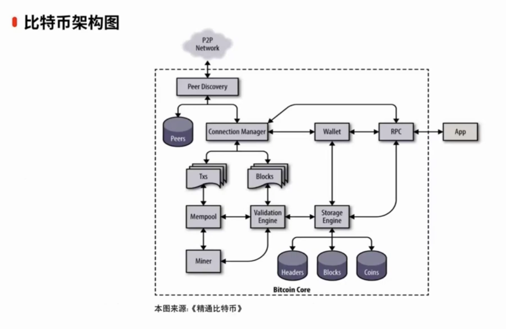
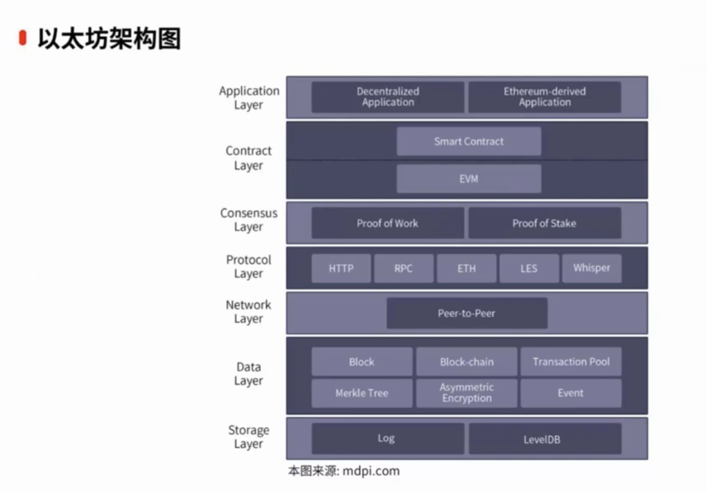

# 区块链安全

区块链安全的分类，讨论最多的是应用层和合约层

```
区块链应用安全⬇️                   应用层         可编程货币
                                              可编程金融
                                              可编程社会
--------------------------------------------------------------------------------

区块链安全⬇️                      合约层         脚本代码、算法机制、智能合约

                                激励层         发行机制、分配机制


                                共识层         PoW 、PoS、DPos 。。。。

                                网络层         P2P、传播机制、验证机制

                                数据层         数据区块、链式结构、时间戳
                                              哈希函数、Merkle 树、非对称加密


```





### unlockAccount

- 私钥在内存中保存的时间，默认是 300s
- 如果设置为 0 ，则表示永久留在内存，直至 Geth/Parity 退出

#### eth_sendTransaction

- nonce 的递增从 0 开始每一笔交易加 1
- nonce 和 unlockAccount 只和当前钱包有关
- nonce 过大时，只需要等待小于这个过大 nonce 之前所有的 nonce 都用完即可
- 节点程序（Geth/Parity）重启会重置 unlockAccount 时间

避免方式

- 节点默认开放在 `0.0.0.0` 。在配置开放地址的时候，需要指定 `--rpcaddr < 指定访问的 IP 白名单地址 >`
- 私钥与服务器分离
- 设置 RPC 接口方法的调用白名单

同时节点程序在代码中应要对默认配置进行安全加固，节点默认开放在 `127.0.0.1`

### P2P 相关

异形攻击：指诱使同类链的节点相互侵入和污染的一种攻击手法，漏洞的主要原因是同类链系统在通信协议上没有对非同类节点做识别。

当目标公链使用了兼容的握手和节点发现协议，就无法区分节点是否属于同一个链，这样就可以通过异形攻击，导致地址池相互污染，节点通信性能下降，最终造成节点阻塞。

以太坊同类链节点之间通过 4 个 UDP 通信协议来完成节点发现

- Ping：探测一个节点是否在线
- Pong：相应 Ping 命令
- Findnode：查找与 target 节点异或距离最近的其它节点
- Neighbors：相应 FindNode 命令，返回一个或多个节点

完成握手和节点发现后，便会将节点加入自己的节点池子中，并且当有其它节点来请求 FindNode 的时候，便会把 Neighbor 推送过去，自行扩散交换节点间的邻居信息。

利用不同链当握手和节点发现协议可以相互兼容的特点，**将节点数量规模较大的链的节点数据推送到节点数据规模较小的链**，让不同链之间的节点数据相互污染，从而实施异形攻击。

### JSON-RPC 安全

为了让应用程序能够和区块链进行交互（读取区块链数据或发送交易信息到网络），区块链节点程序遵循 JSON-RPC 的规范开放一系列的 RPC 方法，让应用程序能够方便的访问区块链数据，如：交易数据，区块数据等。

#### RPC 分类

按照权限进行分解，可以分为特殊权限才能调用的 RPC 方法和公开调用的 RPC 方法。

- 确定哪些 RPC 方法是公开调用的。

### 智能合约模块

- 对输入输出进行检查（角色权限检查，变量范围检查，返回值检查，运算顺序及结果检查等）
- 所有涉及到数据变动的地方都要看是否会因为没有检查导致引入安全问题。
- 大部分情况下合约代码的逻辑是相对公平的，如果出现一方可以不断获利，必然另一方会有亏损，这样需要就业务逻辑再次确认
- solidity 本身的特性结合项目业务也容易产生 bug

防御方式

- 避免使用低级调用
- 尽可能先执行内部调用，再进行外部合约调用
- 使用类似 SafeMath 的安全模块
- 合理使用互斥锁
- 编码规范进行约束，遵循：先判断，后写入变量，再进行外部调用（Check-Effects-Interactions）

新手要了解智能合约安全靶场的一些技巧：

- https://solidity-by-example.org/
- https://github.com/OpenZeppelin/ethernaut
- https://github.com/OpenZeppelin/damn-vulnerable-defi
- https://github.com/thec00n/smart-contract-honeypots

## 区块链生态安全

### 去中心化钱包

- 2022.9.20 Wintermute 为了节省 Gas 费用使用了 Profanity 来创建 Vanity 钱包。

  - 使用 32 为随机数放入到 64 位种子发生器，并用 64 位发生器的值填充 265 位的私钥。

- Demonic Vulnerability

  - 使用 FSMonitor 工具监控文件变化。`/Users/$(whoami)/Library/Application Support/Google/Chrome/Default/Sessions`
  - 导入助记词 `Show Secret Recovery Phrase` 选中时，那么助记词有可能就泄露了

- 钱包插件，点击劫持
- 浏览器端，执行时有可能泄露私钥
- 假充值欺诈

常见的 web3 钱包钓鱼可以分为 3 类

- 盗助记词或私钥

  - 假钱包应用

- 恶意修改转账的目标地址

  - 假社交 app
  - 假交易平台

- 欺骗用户签名恶意的交易
  - 如 Approve、 increaseAllowance 等

[区块链黑暗森林自救手册](https://darkhandbook.io/)
