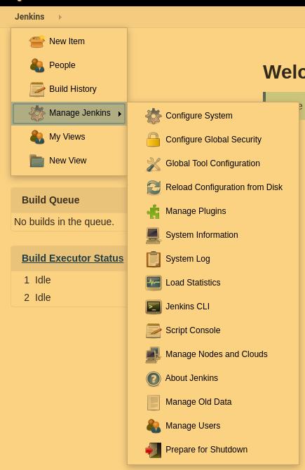

# jenkins [安装](https://pkg.jenkins.io/debian-stable/)

```bash
wget -q -O - https://pkg.jenkins.io/debian-stable/jenkins.io.key | sudo apt-key add -
sudo sh -c 'echo deb http://pkg.jenkins.io/debian-stable binary/ > /etc/apt/sources.list.d/jenkins.list'
sudo apt-get update
sudo apt-get install jenkins


# 启动Jenkins （Jenkins默认端口是8080，如果这个端口被占用请更改Jenkins端口）
systemctl start jenkins

# 密码未知
sudo less /var/lib/jenkins/secrets/initialAdminPassword

```

## jenkin 插件管理

- NodeJS
- GitHub

### Jenkins目录说明



- new Item 创建一个项目
    - free style 构件一个自由风格的项目，这个模式创建之后可以随意编排项目的构建流程
    - 流水线pipe line（master-node模式），这个是Jenkins的精髓，Jenkins是分布式
    的，分为主节点和工作节点，每个节点都有自己的工作
    - 多项目配置：为多个环境下测试使用
    - 多分支流水线：为了多个版本，多个子项目等情况下使用
    - 文件夹：整理项目文件
- people 用来展示Jenkins中的用户
- build-history 构建历史，展示所有的构建日子
- Manage Jenkins 系统管理：
    - config system 系统设置：
        - Home directory： Jenkins工作路径
        - System Message 欢迎语
        - of executors ：Jenkins同时可以跑的项目数
        - usage: 配置分布式集群时使用
        - Global properties：全局配置
            - Environment variables：环境变量
            - Tool Locations：工具位置，当使用git，maven等时配置的第三方工具路径
        - Jenkins location： 
            - Jenkins URL ： 访问Jenkins的URL
            - email：管理员邮箱
        - github： 配置git
            - 凭据： 一般在这里选择已经保存好的凭据，而不是在这里直接添加凭据
        - ssh server
    - config global security 全局安全配置
        - Jenkins’ own user database 使用Jenkins 专有用户数据库
        - 这里的内容基本不用动
    - Global Tool Configuration（全局工具配置）
        - 这里配置开发工具的版本，根据也无需求，可以配置多个
    - reload config from disk（如果有配置配错了，可以点这里，恢复原有的默认配置）
    - manage plugins 插件管理
        - update 可以更新的
        - available  插件仓库
        - installed  已安装
            - nodejs node环境需要的依赖
            - github git工具需要的依赖
            - ssh
        - advanced
            - proxy 配置代理时使用
    -  Jenkins CLI Jenkins的命令行接口，可以自己实现Jenkins的样式，通过调用Jenkins接口
    - Config File Management 管理配置文件模板
    - prepare to shutdown 准备关机，等待所有正在跑的任务结束后关闭Jenkins  

### 问题处理(如果安装困难建议使用docker方式安装)

- Jenkins 问题 No such plugin: cloudbees-folder

    解决方案：

    上面的错误显示是，安装插件 cloudbees-folder 失败，是因为下载的 Jenkins.war 里没有 cloudbees-folder 插件,需要去 https://updates.jenkins-ci.org/download/plugins/cloudbees-folder/ 下载一个插件
    访问 IP:PORT/restart，越过配置插件的页面，直接访问
    点击【系统管理】–【管理插件】–【高级】–【上传插件】，手动安装下载好的插件，重新访问 
