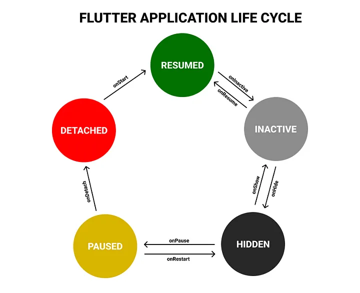

# 声明周期

### 应用生命周期

- resumed: 应用可见，前台运行。进入交互状态
- inactive: 应用可见，后台运行, 不和用户交互
- hidden: 应用不可见，后台运行. 如 应用最小化、被其他应用覆盖
- paused: 应用不可见，不执行代码。
- detached: 应用进程终结

### [widget 生命周期](https://github.com/flutter/flutter/blob/master/examples/layers/services/lifecycle.dart)

[网友解读](https://www.bookstack.cn/read/flutterbyexample/aebe8dda4df3319f.md)

- createState: 创建 stateful widget 实例
- mounted : buildContext 下的所有组件的 this.mounted == true 时
- initState: 初始化 widget, 只执行一次
- didChangeDependencies: initState 后立即执行 or 当依赖项改变时调用，如 Provider、Bloc 等 ？？？
- build: 构建 widget, state 改变时也会调用
- didUpdateWidget: 当 widget 的属性改变时调用
- setState: 改变 state
- deactivate: widget 被移除时调用
- dispose: widget 被销毁时调用

### 开发中常用的声明周期

- initState: 初始化 widget
- didChangeDependencies：初始化会执行一次，当 widget 的依赖项改变时执行
- didUpdateWidget: canupdateWidget 返回 true 时执行
  - 父组件 state 变化时执行
- deactivate: 页面退出时执行
- dispose: 页面销毁时执行(永久性的移除 widget 时执行)
- reassemble： debugger 模式下，热重载时执行
