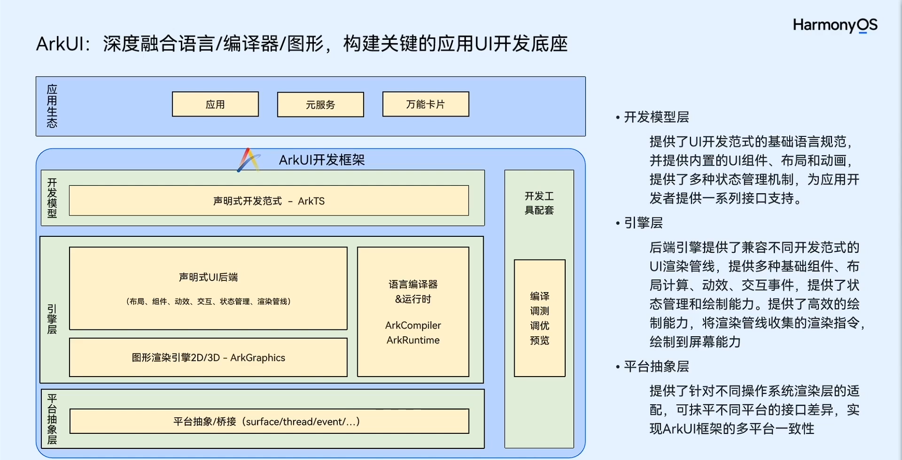
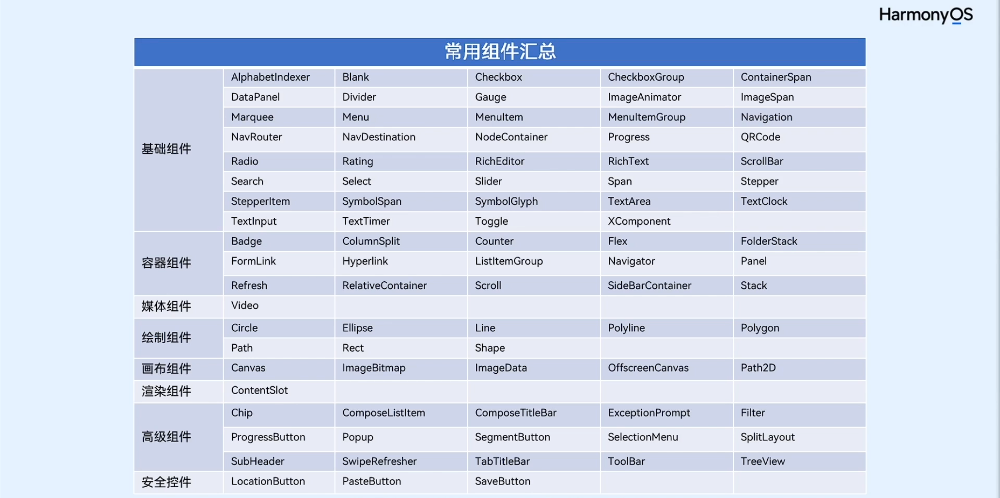

# [arkUI](https://developer.huawei.com/consumer/cn/doc/harmonyos-guides-V5/arkui-overview-V5) 

ArkUI是一套构建分布式应用界面的声明式UI开发框架。它使用简洁的UI信息语法、丰富的UI组件、以及实时界面预览工具，帮助您提升HarmonyOS应用界面开发效率30%。您只需使用一套ArkTS API，就能在多个HarmonyOS设备上提供生动而流畅的用户界面体验。

ArkUI框架提供了基于XComponent组件的C++自绘制引擎接入（比如游戏引擎）能力，和基于Web组件的HTML5/Web的渲染能力。满足了开发者在游戏、相机、地图、浏览器等复杂应用场景的开发诉求，降低了这类应用移植的门槛。

### 常用组件

- button
- text
- image
- row / column
- list
- grid / griditem
- swiper
- waterflow
- patternLock 滑动密码
- slider 滑块
- tabs
- customdialog
- calendarPicker
- textpicker
- datePicker
- TimePicker 

更多组件请参考图片 

### [布局](https://developer.huawei.com/consumer/cn/doc/harmonyos-guides-V5/arkts-layout-development-overview-V5)

- 线性布局 （row/column）
- 弹性布局 （flex）在线性布局基础上加了弹性控制
- 层叠布局 （stack） 类似 html 中的定位
- 栅格布局 （gridRow/GridCol）
- 网格 （grid） 多了网格元素的弹性适配
- 媒体查询 （`@ohos.mediaquery`）
- 列表 （list）

