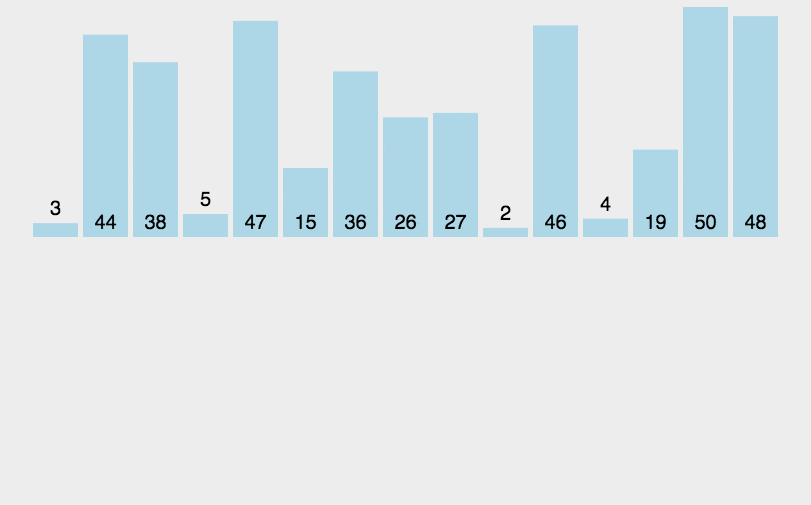
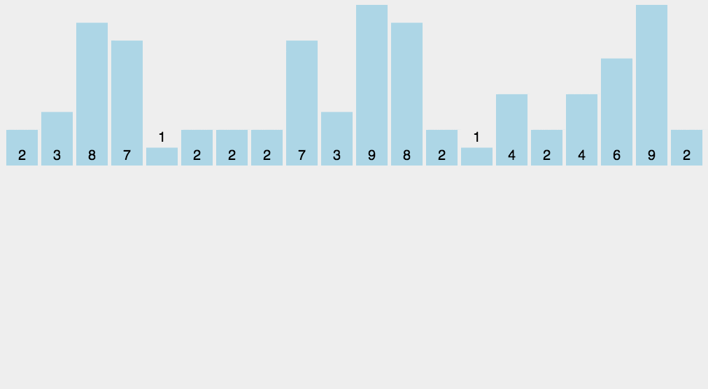

# 经典排序算法

排序算法是《数据结构与算法》中最基本的算法之一。

排序算法可以分为内部排序和外部排序，内部排序是数据记录在内存中进行排序，而外部排序是因排序的数据很大，一次不能容纳全部的排序记录，在排序过程中需要访问外存。常见的内部排序算法有：插入排序、希尔排序、选择排序、冒泡排序、归并排序、快速排序、堆排序、基数排序等。


### 冒泡排序

1. 算法步骤

比较相邻的元素。如果第一个比第二个大，就交换他们两个。

对每一对相邻元素作同样的工作，从开始第一对到结尾的最后一对。这步做完后，最后的元素会是最大的数。

针对所有的元素重复以上的步骤，除了最后一个。

持续每次对越来越少的元素重复上面的步骤，直到没有任何一对数字需要比较。


```js
function bubbleSort(arr) {
    var len = arr.length;
    for (var i = 0; i < len - 1; i++) {
        for (var j = 0; j < len - 1 - i; j++) {
            if (arr[j] > arr[j+1]) {        // 相邻元素两两对比
                var temp = arr[j+1];        // 元素交换
                arr[j+1] = arr[j];
                arr[j] = temp;
            }
        }
    }
    return arr;
}
```

### 选择排序

1. 算法步骤

首先在未排序序列中找到最小（大）元素，存放到排序序列的起始位置。

再从剩余未排序元素中继续寻找最小（大）元素，然后放到已排序序列的末尾。

重复第二步，直到所有元素均排序完毕。


```js
function selectionSort(arr) {
    var len = arr.length;
    var minIndex, temp;
    for (var i = 0; i < len - 1; i++) {
        minIndex = i;
        for (var j = i + 1; j < len; j++) {
            if (arr[j] < arr[minIndex]) {     // 寻找最小的数
                minIndex = j;                 // 将最小数的索引保存
            }
        }
        temp = arr[i];
        arr[i] = arr[minIndex];
        arr[minIndex] = temp;
    }
    return arr;
}
```

### 插入排序

算法步骤

将第一待排序序列第一个元素看做一个有序序列，把第二个元素到最后一个元素当成是未排序序列。

从头到尾依次扫描未排序序列，将扫描到的每个元素插入有序序列的适当位置。（如果待插入的元素与有序序列中的某个元素相等，则将待插入元素插入到相等元素的后面。）


```js
function insertionSort(arr) {
    var len = arr.length;
    var preIndex, current;
    for (var i = 1; i < len; i++) {
        preIndex = i - 1;
        current = arr[i];
        while(preIndex >= 0 && arr[preIndex] > current) {
            arr[preIndex+1] = arr[preIndex];
            preIndex--;
        }
        arr[preIndex+1] = current;
    }
    return arr;
}
```

### 希尔排序

希尔排序，也称递减增量排序算法，是插入排序的一种更高效的改进版本。但希尔排序是非稳定排序算法。

希尔排序是基于插入排序的以下两点性质而提出改进方法的：

- 插入排序在对几乎已经排好序的数据操作时，效率高，即可以达到线性排序的效率；
- 但插入排序一般来说是低效的，因为插入排序每次只能将数据移动一位；

希尔排序的基本思想是：先将整个待排序的记录序列分割成为若干子序列分别进行直接插入排序，待整个序列中的记录"基本有序"时，再对全体记录进行依次直接插入排序。

1. 算法步骤

选择一个增量序列 t1，t2，……，tk，其中 ti > tj, tk = 1；

按增量序列个数 k，对序列进行 k 趟排序；

每趟排序，根据对应的增量 ti，将待排序列分割成若干长度为 m 的子序列，分别对各子表进行直接插入排序。仅增量因子为 1 时，整个序列作为一个表来处理，表长度即为整个序列的长度。

[演示动画](https://www.bilibili.com/video/BV1vA411u7cT/?vd_source=076642e5560708d049a6805c50c5ad0e)

```js
function shellSort(arr) {
    var len = arr.length,
        temp,
        gap = 1;
    while(gap < len/3) {          //动态定义间隔序列
        gap =gap*3+1;
    }
    for (gap; gap > 0; gap = Math.floor(gap/3)) {
        for (var i = gap; i < len; i++) {
            temp = arr[i];
            for (var j = i-gap; j >= 0 && arr[j] > temp; j-=gap) {
                arr[j+gap] = arr[j];
            }
            arr[j+gap] = temp;
        }
    }
    return arr;
}
```

### 归并排序

算法步骤

申请空间，使其大小为两个已经排序序列之和，该空间用来存放合并后的序列；

设定两个指针，最初位置分别为两个已经排序序列的起始位置；

比较两个指针所指向的元素，选择相对小的元素放入到合并空间，并移动指针到下一位置；

重复步骤 3 直到某一指针达到序列尾；

将另一序列剩下的所有元素直接复制到合并序列尾。



```js
function mergeSort(arr) {  // 采用自上而下的递归方法
    var len = arr.length;
    if(len < 2) {
        return arr;
    }
    var middle = Math.floor(len / 2),
        left = arr.slice(0, middle),
        right = arr.slice(middle);
    return merge(mergeSort(left), mergeSort(right));
}

function merge(left, right)
{
    var result = [];

    while (left.length && right.length) {
        if (left[0] <= right[0]) {
            result.push(left.shift());
        } else {
            result.push(right.shift());
        }
    }

    while (left.length)
        result.push(left.shift());

    while (right.length)
        result.push(right.shift());

    return result;
}
```

### 快速排序

1. 算法步骤

从数列中挑出一个元素，称为 "基准"（pivot）;

重新排序数列，所有元素比基准值小的摆放在基准前面，所有元素比基准值大的摆在基准的后面（相同的数可以到任一边）。在这个分区退出之后，该基准就处于数列的中间位置。这个称为分区（partition）操作；

递归地（recursive）把小于基准值元素的子数列和大于基准值元素的子数列排序；

[演示动画](https://www.bilibili.com/video/BV1rW4y1x7Kh/?spm_id_from=333.337.search-card.all.click&vd_source=076642e5560708d049a6805c50c5ad0e)

```js
function quickSort(arr, left, right) {
    var len = arr.length,
        partitionIndex,
        left = typeof left != 'number' ? 0 : left,
        right = typeof right != 'number' ? len - 1 : right;

    if (left < right) {
        partitionIndex = partition(arr, left, right);
        quickSort(arr, left, partitionIndex-1);
        quickSort(arr, partitionIndex+1, right);
    }
    return arr;
}

function partition(arr, left ,right) {     // 分区操作
    var pivot = left,                      // 设定基准值（pivot）
        index = pivot + 1;
    for (var i = index; i <= right; i++) {
        if (arr[i] < arr[pivot]) {
            swap(arr, i, index);
            index++;
        }        
    }
    swap(arr, pivot, index - 1);
    return index-1;
}

function swap(arr, i, j) {
    var temp = arr[i];
    arr[i] = arr[j];
    arr[j] = temp;
}
function partition2(arr, low, high) {
  let pivot = arr[low];
  while (low < high) {
    while (low < high && arr[high] > pivot) {
      --high;
    }
    arr[low] = arr[high];
    while (low < high && arr[low] <= pivot) {
      ++low;
    }
    arr[high] = arr[low];
  }
  arr[low] = pivot;
  return low;
}

function quickSort2(arr, low, high) {
  if (low < high) {
    let pivot = partition2(arr, low, high);
    quickSort2(arr, low, pivot - 1);
    quickSort2(arr, pivot + 1, high);
  }
  return arr;
}
```

### 堆排序

算法步骤

创建一个堆 H[0……n-1]；

把堆首（最大值）和堆尾互换；

把堆的尺寸缩小 1，并调用 shift_down(0)，目的是把新的数组顶端数据调整到相应位置；

重复步骤 2，直到堆的尺寸为 1。


```js
var len;    // 因为声明的多个函数都需要数据长度，所以把len设置成为全局变量

function buildMaxHeap(arr) {   // 建立大顶堆
    len = arr.length;
    for (var i = Math.floor(len/2); i >= 0; i--) {
        heapify(arr, i);
    }
}

function heapify(arr, i) {     // 堆调整
    var left = 2 * i + 1,
        right = 2 * i + 2,
        largest = i;

    if (left < len && arr[left] > arr[largest]) {
        largest = left;
    }

    if (right < len && arr[right] > arr[largest]) {
        largest = right;
    }

    if (largest != i) {
        swap(arr, i, largest);
        heapify(arr, largest);
    }
}

function swap(arr, i, j) {
    var temp = arr[i];
    arr[i] = arr[j];
    arr[j] = temp;
}

function heapSort(arr) {
    buildMaxHeap(arr);

    for (var i = arr.length-1; i > 0; i--) {
        swap(arr, 0, i);
        len--;
        heapify(arr, 0);
    }
    return arr;
}
```

###  计数排序

算法的步骤如下：

（1）找出待排序的数组中最大和最小的元素

（2）统计数组中每个值为i的元素出现的次数，存入数组C的第i项

（3）对所有的计数累加（从C中的第一个元素开始，每一项和前一项相加）

（4）反向填充目标数组：将每个元素i放在新数组的第C(i)项，每放一个元素就将C(i)减去1



```js
function countingSort(arr, maxValue) {
    var bucket = new Array(maxValue+1),
        sortedIndex = 0;
        arrLen = arr.length,
        bucketLen = maxValue + 1;

    for (var i = 0; i < arrLen; i++) {
        if (!bucket[arr[i]]) {
            bucket[arr[i]] = 0;
        }
        bucket[arr[i]]++;
    }

    for (var j = 0; j < bucketLen; j++) {
        while(bucket[j] > 0) {
            arr[sortedIndex++] = j;
            bucket[j]--;
        }
    }

    return arr;
}
```

###  桶排序


桶排序是计数排序的升级版。它利用了函数的映射关系，高效与否的关键就在于这个映射函数的确定。为了使桶排序更加高效，我们需要做到这两点：

- 在额外空间充足的情况下，尽量增大桶的数量
- 使用的映射函数能够将输入的 N 个数据均匀的分配到 K 个桶中

同时，对于桶中元素的排序，选择何种比较排序算法对于性能的影响至关重要。


- 首先，设置固定数量的空桶，在这里为了方便演示，设置桶的数量为 5 个空桶

- 遍历整个数列，找到最大值为 56 ，最小值为 2 ，每个桶的范围为 （ 56 - 2 + 1 ）/ 5 = 11

- 再次遍历整个数列，按照公式 floor((数字 – 最小值) / 11) 将数字放到对应的桶中

- 比如，数字 7 代入公式 floor (( 7  –  2 )  /  11 ) = 0 放入 0 号桶

- 数字 12 代入公式 floor((12 – 2) / 11) = 0 放入 0 号桶

- 数字 56 代入公式 floor((56 – 2) / 11) = 4 放入 4 号桶

- 当向同一个索引的桶，第二次插入数据时，判断桶中已存在的数字与新插入数字的大小，按照左到右，从小到大的顺序插入（可以使用前面讲解的插入排序「任何上面的排序都可以」）实现

- 比如，插入数字 19 时， 1 号桶中已经有数字 23 ，在这里使用插入排序，让 19 排在 23 前面

- 遍历完整个数列后，合并非空的桶，按从左到右的顺序合并 0 ，1 ，2 ，3 ，4 桶。

- 这样就完成了 桶排序

### 基数排序

基数排序是一种非比较型整数排序算法，其原理是将整数按位数切割成不同的数字，然后按每个位数分别比较。由于整数也可以表达字符串（比如名字或日期）和特定格式的浮点数，所以基数排序也不是只能使用于整数。

1. 基数排序 vs 计数排序 vs 桶排序

基数排序有两种方法：

这三种排序算法都利用了桶的概念，但对桶的使用方法上有明显差异：

- 基数排序：根据键值的每位数字来分配桶；
- 计数排序：每个桶只存储单一键值；
- 桶排序：每个桶存储一定范围的数值；


```js
//LSD Radix Sort
var counter = [];
function radixSort(arr, maxDigit) {
    var mod = 10;
    var dev = 1;
    for (var i = 0; i < maxDigit; i++, dev *= 10, mod *= 10) {
        for(var j = 0; j < arr.length; j++) {
            var bucket = parseInt((arr[j] % mod) / dev);
            if(counter[bucket]==null) {
                counter[bucket] = [];
            }
            counter[bucket].push(arr[j]);
        }
        var pos = 0;
        for(var j = 0; j < counter.length; j++) {
            var value = null;
            if(counter[j]!=null) {
                while ((value = counter[j].shift()) != null) {
                      arr[pos++] = value;
                }
          }
        }
    }
    return arr;
}
```